# Correlates of Active Transport to School

## Data Setup

```r
> require(foreign)
> dir  <- "/home/john/Dropbox/Research/Collaboration/BEATS/John/Data"
> file <- "BEATS_StudentS_DATA-All_150424.sav"
> dat <- read.spss( paste(dir, file, sep="/"), to.data.frame=TRUE)
```


## Introduction

This document contains preliminary analyses of correlates of ATS (**A**ctive 
**T**ransport to **S**chool). We know from previous work (and common sense!) 
that the most influential correlate is distance from school. But once that is 
factored out, what else is influential?

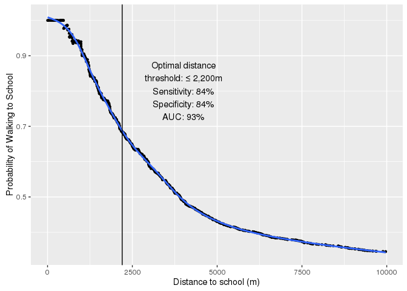

The figure above shows the empirical probability of ATS, i.e. the proportion of 
respondents who use ATS at each level of observed distance to school. The observations 
plotted are those respondents who live less than 8km from school, however the analysis
below is restricted to students who live less than 4800m from school.

## Descriptive statistics

Firstly, let's look at the distributions of the variables we'll be dealing with. 
The starting model will be the same model as previously used for the 
*Journal of Science and Medicine in Sport* manuscript, so we need to assess 
the distribution of the variables used in that model.

The analyses below are restricted to the students who live less than 
4800m from school, and who are not boarders. There are
699 students who fit that criterion.

<table class='gmisc_table' style='border-collapse: collapse;'  id='Table1'>
<thead>
<tr><td colspan='4' style='text-align: left;'>
<strong>Table 1</strong>: Individual and household potential correlates of ATS</td></tr>
<tr>
<th style='font-weight: 900; border-bottom: 1px solid grey; border-top: 2px solid grey; text-align: center;'>Variable<sup>&dagger;</sup></th>
<th style='border-bottom: 1px solid grey; border-top: 2px solid grey; text-align: center;'>Motorised<br /> No. 387</th>
<th style='border-bottom: 1px solid grey; border-top: 2px solid grey; text-align: center;'>Active<br /> No. 312</th>
<th style='border-bottom: 1px solid grey; border-top: 2px solid grey; text-align: center;'>P-value</th>
</tr>
</thead>
<tbody> 
<tr><td colspan='4' style='font-weight: 900;'>Distance to school (m)</td></tr>
<tr>
<td style='text-align: left;'>&nbsp;&nbsp;Dist2School</td>
<td style='text-align: center;'>2865.2 (&plusmn;1102.9)</td>
<td style='text-align: center;'>1362.7 (&plusmn;886.7)</td>
<td style='text-align: center;'>&lt; 0.0001</td>
</tr> 
<tr><td colspan='4' style='font-weight: 900;'>Age</td></tr>
<tr>
<td style='text-align: left;'>&nbsp;&nbsp;Age_Cat</td>
<td style='text-align: center;'>15.3 (&plusmn;1.5)</td>
<td style='text-align: center;'>15.2 (&plusmn;1.3)</td>
<td style='text-align: center;'>0.49</td>
</tr> 
<tr><td colspan='4' style='font-weight: 900;'>Sex</td></tr>
<tr>
<td style='text-align: left;'>&nbsp;&nbsp;Male</td>
<td style='text-align: center;'>178 (46.0%)</td>
<td style='text-align: center;'>141 (45.2%)</td>
<td style='text-align: center;'>0.88</td>
</tr>
<tr>
<td style='text-align: left;'>&nbsp;&nbsp;Female</td>
<td style='text-align: center;'>209 (54.0%)</td>
<td style='text-align: center;'>171 (54.8%)</td>
<td style='text-align: center;'></td>
</tr> 
<tr><td colspan='4' style='font-weight: 900;'>BMI</td></tr>
<tr>
<td style='text-align: left;'>&nbsp;&nbsp;Healthy weight</td>
<td style='text-align: center;'>250 (64.6%)</td>
<td style='text-align: center;'>210 (67.3%)</td>
<td style='text-align: center;'>0.30</td>
</tr>
<tr>
<td style='text-align: left;'>&nbsp;&nbsp;Unhealthy weight</td>
<td style='text-align: center;'>113 (29.2%)</td>
<td style='text-align: center;'>78 (25.0%)</td>
<td style='text-align: center;'></td>
</tr>
<tr>
<td style='text-align: left;'>&nbsp;&nbsp;Missing</td>
<td style='text-align: center;'>24 (6.2%)</td>
<td style='text-align: center;'>24 (7.7%)</td>
<td style='text-align: center;'></td>
</tr> 
<tr><td colspan='4' style='font-weight: 900;'>Number of cars at home</td></tr>
<tr>
<td style='text-align: left;'>&nbsp;&nbsp;None</td>
<td style='text-align: center;'>9 (2.3%)</td>
<td style='text-align: center;'>23 (7.4%)</td>
<td style='text-align: center;'>&lt; 0.0001</td>
</tr>
<tr>
<td style='text-align: left;'>&nbsp;&nbsp;One</td>
<td style='text-align: center;'>100 (25.8%)</td>
<td style='text-align: center;'>135 (43.3%)</td>
<td style='text-align: center;'></td>
</tr>
<tr>
<td style='text-align: left;'>&nbsp;&nbsp;Two</td>
<td style='text-align: center;'>178 (46.0%)</td>
<td style='text-align: center;'>105 (33.7%)</td>
<td style='text-align: center;'></td>
</tr>
<tr>
<td style='text-align: left;'>&nbsp;&nbsp;Three</td>
<td style='text-align: center;'>68 (17.6%)</td>
<td style='text-align: center;'>38 (12.2%)</td>
<td style='text-align: center;'></td>
</tr>
<tr>
<td style='text-align: left;'>&nbsp;&nbsp;Four+</td>
<td style='text-align: center;'>32 (8.3%)</td>
<td style='text-align: center;'>11 (3.5%)</td>
<td style='text-align: center;'></td>
</tr> 
<tr><td colspan='4' style='font-weight: 900;'>NZ Deprivation Index</td></tr>
<tr>
<td style='text-align: left;'>&nbsp;&nbsp;High</td>
<td style='text-align: center;'>148 (38.2%)</td>
<td style='text-align: center;'>96 (30.8%)</td>
<td style='text-align: center;'>0.11</td>
</tr>
<tr>
<td style='text-align: left;'>&nbsp;&nbsp;Med</td>
<td style='text-align: center;'>155 (40.1%)</td>
<td style='text-align: center;'>144 (46.2%)</td>
<td style='text-align: center;'></td>
</tr>
<tr>
<td style='text-align: left;'>&nbsp;&nbsp;Low</td>
<td style='text-align: center;'>82 (21.2%)</td>
<td style='text-align: center;'>71 (22.8%)</td>
<td style='text-align: center;'></td>
</tr>
<tr>
<td style='text-align: left;'>&nbsp;&nbsp;Missing</td>
<td style='text-align: center;'>2 (0.5%)</td>
<td style='text-align: center;'>1 (0.3%)</td>
<td style='text-align: center;'></td>
</tr> 
<tr><td colspan='4' style='font-weight: 900;'>Too tired to use ATS</td></tr>
<tr>
<td style='text-align: left;'>&nbsp;&nbsp;Often too tired</td>
<td style='text-align: center;'>2.8 (&plusmn;0.9)</td>
<td style='text-align: center;'>1.9 (&plusmn;0.9)</td>
<td style='text-align: center;'>&lt; 0.0001</td>
</tr> 
<tr><td colspan='4' style='font-weight: 900;'>Parents say I should use ATS</td></tr>
<tr>
<td style='text-align: left;'>&nbsp;&nbsp;pshould</td>
<td style='text-align: center;'>4.2 (&plusmn;1.7)</td>
<td style='text-align: center;'>6.3 (&plusmn;1.2)</td>
<td style='text-align: center;'>&lt; 0.0001</td>
</tr> 
<tr><td colspan='4' style='font-weight: 900;'>School is on the way to work</td></tr>
<tr>
<td style='text-align: left;'>&nbsp;&nbsp;onway</td>
<td style='text-align: center;'>3.1 (&plusmn;1.0)</td>
<td style='text-align: center;'>1.8 (&plusmn;1.0)</td>
<td style='text-align: center;'>&lt; 0.0001</td>
</tr> 
<tr><td colspan='4' style='font-weight: 900;'>Meets screen time guidelines</td></tr>
<tr>
<td style='text-align: left;'>&nbsp;&nbsp;Not meeting guidelines: more than 2 hrs per day</td>
<td style='text-align: center;'>338 (87.3%)</td>
<td style='text-align: center;'>277 (88.8%)</td>
<td style='text-align: center;'>0.64</td>
</tr>
<tr>
<td style='text-align: left;'>&nbsp;&nbsp;Meeting guidelines: up to 2 hrs per day</td>
<td style='text-align: center;'>49 (12.7%)</td>
<td style='text-align: center;'>35 (11.2%)</td>
<td style='text-align: center;'></td>
</tr> 
<tr><td colspan='4' style='font-weight: 900;'>My parents think its unsafe to use ATS</td></tr>
<tr>
<td style='text-align: left;'>&nbsp;&nbsp;punsafe</td>
<td style='text-align: center;'>1.7 (&plusmn;0.9)</td>
<td style='text-align: center;'>1.2 (&plusmn;0.5)</td>
<td style='text-align: center;'>&lt; 0.0001</td>
</tr> 
<tr><td colspan='4' style='font-weight: 900;'>Travel in general: Walking</td></tr>
<tr>
<td style='text-align: left;'>&nbsp;&nbsp;regwalk</td>
<td style='text-align: center;'>2.7 (&plusmn;0.9)</td>
<td style='text-align: center;'>3.9 (&plusmn;0.9)</td>
<td style='text-align: center;'>&lt; 0.0001</td>
</tr> 
<tr><td colspan='4' style='font-weight: 900;'>It takes too much time to walk to school</td></tr>
<tr>
<td style='text-align: left;'>&nbsp;&nbsp;time</td>
<td style='text-align: center;'>3.0 (&plusmn;0.9)</td>
<td style='text-align: center;'>1.7 (&plusmn;0.9)</td>
<td style='text-align: center;'>&lt; 0.0001</td>
</tr> 
<tr><td colspan='4' style='font-weight: 900;'>Number of siblings</td></tr>
<tr>
<td style='text-align: left;'>&nbsp;&nbsp;None</td>
<td style='text-align: center;'>18 (4.7%)</td>
<td style='text-align: center;'>24 (7.7%)</td>
<td style='text-align: center;'>0.091</td>
</tr>
<tr>
<td style='text-align: left;'>&nbsp;&nbsp;1</td>
<td style='text-align: center;'>141 (36.4%)</td>
<td style='text-align: center;'>98 (31.4%)</td>
<td style='text-align: center;'></td>
</tr>
<tr>
<td style='text-align: left;'>&nbsp;&nbsp;2</td>
<td style='text-align: center;'>105 (27.1%)</td>
<td style='text-align: center;'>90 (28.8%)</td>
<td style='text-align: center;'></td>
</tr>
<tr>
<td style='text-align: left;'>&nbsp;&nbsp;3</td>
<td style='text-align: center;'>57 (14.7%)</td>
<td style='text-align: center;'>36 (11.5%)</td>
<td style='text-align: center;'></td>
</tr>
<tr>
<td style='text-align: left;'>&nbsp;&nbsp;4</td>
<td style='text-align: center;'>23 (5.9%)</td>
<td style='text-align: center;'>29 (9.3%)</td>
<td style='text-align: center;'></td>
</tr>
<tr>
<td style='text-align: left;'>&nbsp;&nbsp;5 or more</td>
<td style='text-align: center;'>0 (0.0%)</td>
<td style='text-align: center;'>0 (0.0%)</td>
<td style='text-align: center;'></td>
</tr>
<tr>
<td style='text-align: left;'>&nbsp;&nbsp;Missing</td>
<td style='text-align: center;'>43 (11.1%)</td>
<td style='text-align: center;'>35 (11.2%)</td>
<td style='text-align: center;'></td>
</tr> 
<tr><td colspan='4' style='font-weight: 900;'>Number of bikes available for ATS at home</td></tr>
<tr>
<td style='text-align: left;'>&nbsp;&nbsp;None</td>
<td style='text-align: center;'>103 (26.6%)</td>
<td style='text-align: center;'>100 (32.1%)</td>
<td style='text-align: center;'>0.23</td>
</tr>
<tr>
<td style='text-align: left;'>&nbsp;&nbsp;One</td>
<td style='text-align: center;'>85 (22.0%)</td>
<td style='text-align: center;'>60 (19.2%)</td>
<td style='text-align: center;'></td>
</tr>
<tr>
<td style='text-align: left;'>&nbsp;&nbsp;Two</td>
<td style='text-align: center;'>62 (16.0%)</td>
<td style='text-align: center;'>61 (19.6%)</td>
<td style='text-align: center;'></td>
</tr>
<tr>
<td style='text-align: left;'>&nbsp;&nbsp;Three</td>
<td style='text-align: center;'>48 (12.4%)</td>
<td style='text-align: center;'>31 (9.9%)</td>
<td style='text-align: center;'></td>
</tr>
<tr>
<td style='text-align: left;'>&nbsp;&nbsp;Four or more</td>
<td style='text-align: center;'>89 (23.0%)</td>
<td style='text-align: center;'>60 (19.2%)</td>
<td style='text-align: center;'></td>
</tr> 
<tr><td colspan='4' style='font-weight: 900;'>Who makes the decision on travel mode?</td></tr>
<tr>
<td style='text-align: left;'>&nbsp;&nbsp;I do</td>
<td style='text-align: center;'>190 (49.1%)</td>
<td style='text-align: center;'>220 (70.5%)</td>
<td style='text-align: center;'>&lt; 0.0001</td>
</tr>
<tr>
<td style='text-align: left;'>&nbsp;&nbsp;My parents</td>
<td style='text-align: center;'>170 (43.9%)</td>
<td style='text-align: center;'>80 (25.6%)</td>
<td style='text-align: center;'></td>
</tr>
<tr>
<td style='text-align: left;'>&nbsp;&nbsp;School</td>
<td style='text-align: center;'>0 (0.0%)</td>
<td style='text-align: center;'>0 (0.0%)</td>
<td style='text-align: center;'></td>
</tr>
<tr>
<td style='text-align: left;'>&nbsp;&nbsp;Other(s)</td>
<td style='text-align: center;'>27 (7.0%)</td>
<td style='text-align: center;'>12 (3.8%)</td>
<td style='text-align: center;'></td>
</tr> 
<tr><td colspan='4' style='font-weight: 900;'>School decile (1--6=least deprived)</td></tr>
<tr>
<td style='text-align: left;'>&nbsp;&nbsp;school_decile_n</td>
<td style='text-align: center;'>3.3 (&plusmn;1.8)</td>
<td style='text-align: center;'>2.9 (&plusmn;1.7)</td>
<td style='text-align: center;'>0.003</td>
</tr> 
<tr><td colspan='4' style='font-weight: 900;'>Physical activity guidelines</td></tr>
<tr>
<td style='text-align: left;'>&nbsp;&nbsp;No</td>
<td style='text-align: center;'>325 (84.0%)</td>
<td style='text-align: center;'>256 (82.1%)</td>
<td style='text-align: center;'>0.54</td>
</tr>
<tr>
<td style='border-bottom: 2px solid grey; text-align: left;'>&nbsp;&nbsp;Yes</td>
<td style='border-bottom: 2px solid grey; text-align: center;'>62 (16.0%)</td>
<td style='border-bottom: 2px solid grey; text-align: center;'>56 (17.9%)</td>
<td style='border-bottom: 2px solid grey; text-align: center;'></td>
</tr>
</tbody>
<tfoot><tr><td colspan='4'>
<span style='font-size: 80%'>&dagger;All continuous variables are reported with mean and standard deviation: x&#772; (SD). Categorical variables are reported in counts and percentages: count (%).</br>&ddagger; The <i>p</i>-values are from Fisher tests for categorical variables and Wilcoxon tests for continuous variables.</span></td></tr></tfoot>
</table>

### Plots

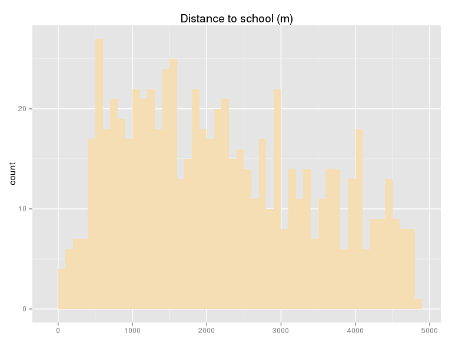

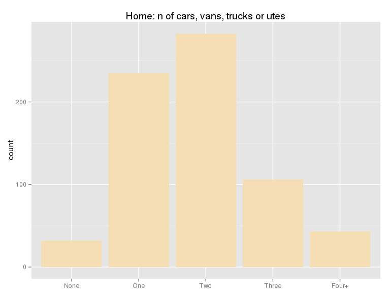

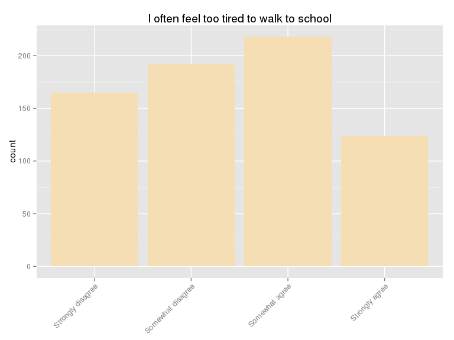

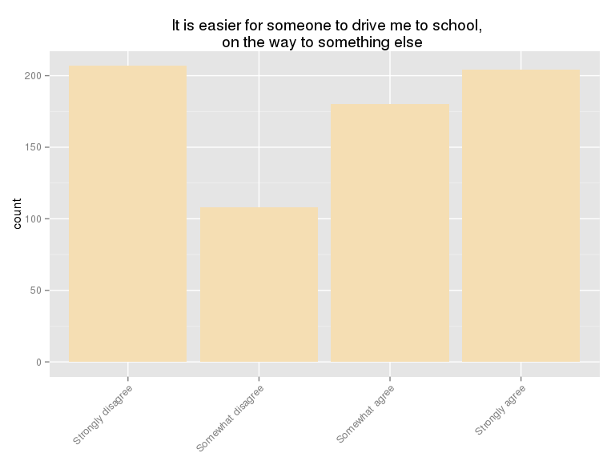

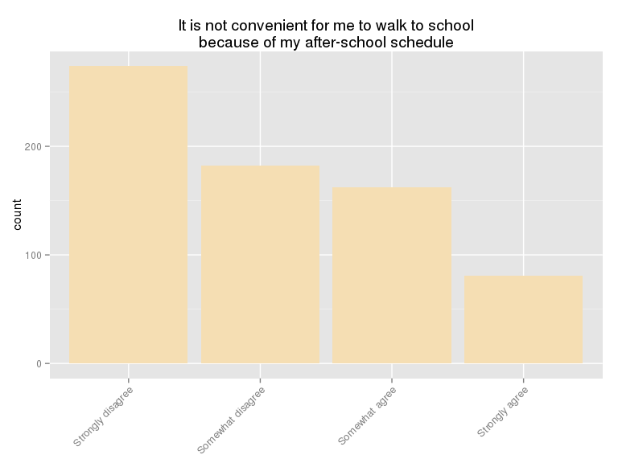

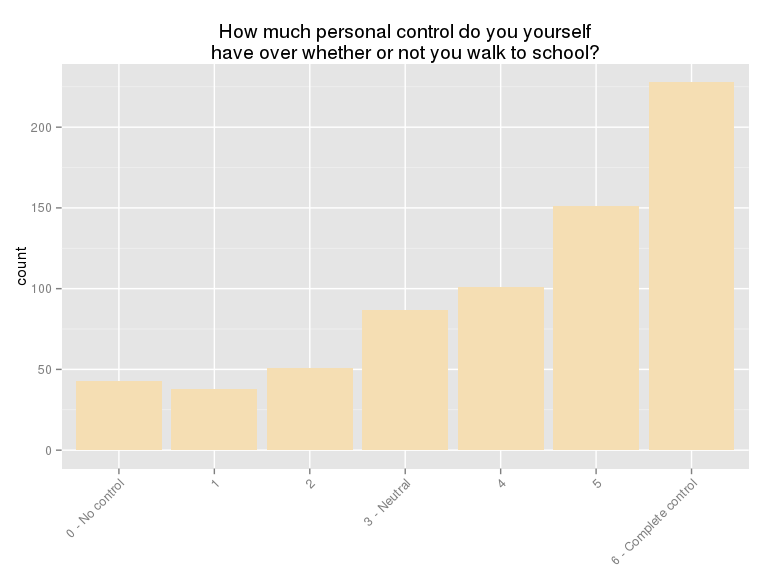

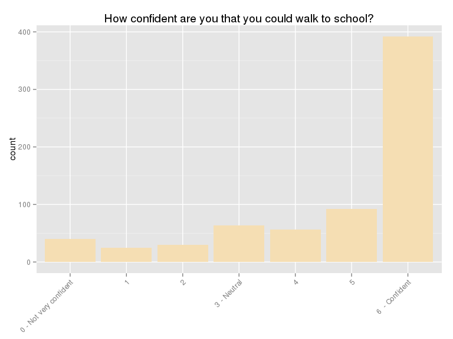

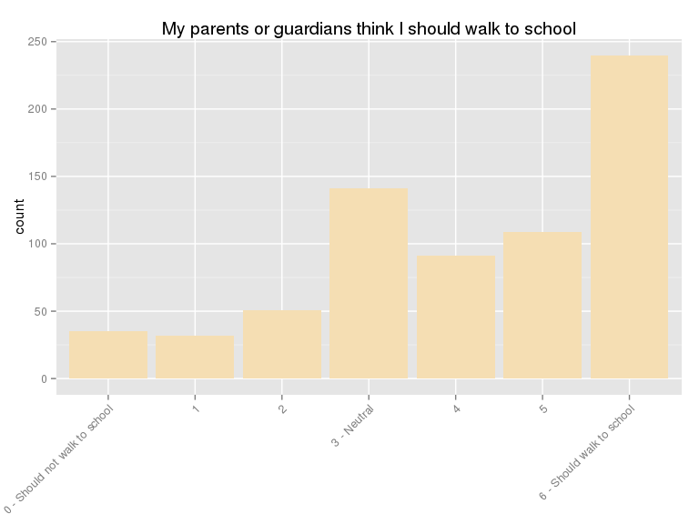

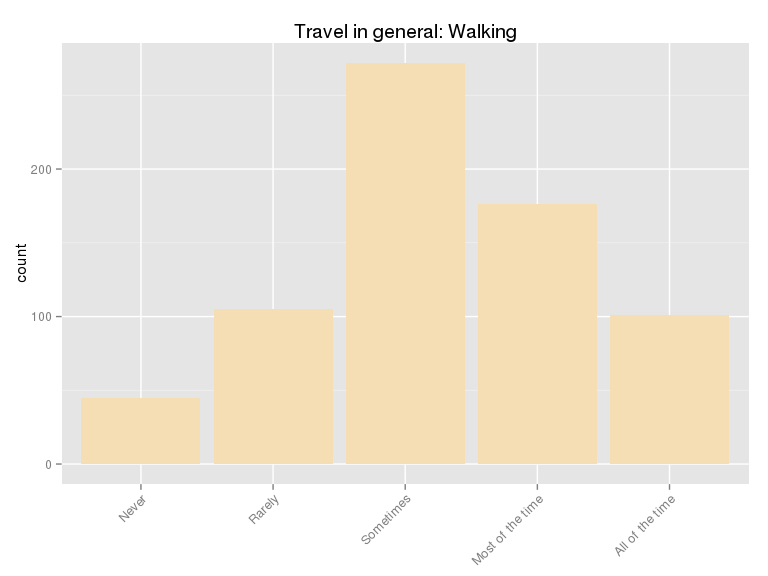


## Modeling

### Model 0
The most influential variable influencing active transport to school is distance 
to school. Hence, a logistic regression model with distance as the single 
explanantory variable will be the "null" or baseline model for model development
purposes. However, as we can see from Figure 1, the relationship between distance 
and probagility of ATS is clearly nonlinear. So a null model should also accomodate 
this fact. I chose to accomodate nonlinearity by use of a restricted cubic spline with 
three knots.


<pre>

<div style='font-size: 80%; background-color: wheat; font-family: monospace'>
Motorised    Active         n </br>
       387       312       699 </br>


</div>
</pre>

<pre>

<div style='font-size: 80%; background-color: wheat; font-family: monospace'>
lrm(formula = ATS_f ~ rcs(Dist2School, 3), data = m0.dat, x = T, </br>
     y = T)</br>


</div>
</pre>

<pre>

<div style='font-size: 80%; background-color: wheat; font-family: monospace'>
                Wald Statistics          Response: ATS_f </br>
 </br>
  Factor      Chi-Square d.f. P     </br>
  Dist2School 186.73     2    &lt;.0001</br>
   Nonlinear    5.83     1    0.0158</br>
  TOTAL       186.73     2    &lt;.0001</br>


</div>
</pre>

<pre>

<div style='font-size: 80%; background-color: wheat; font-family: monospace'>

            Model Summary               
---------------------------------------
Nagelkerke R2      47%        AIC  667
Area under ROC     85%        BIC  681
Balanced accuracy  78%          n 699
Sensitivity        74%         LR  299
Specificity        82%         df    2
---------------------------------------

</div>
</pre>

We can see that this model is reasonably good, for example the area under the 
ROC curve is %, and the Nagelkerke *R^2* is 
%. Also there are only a few influential observations.


The summary table below shows the estimates and 95% confidence intervals for both
the logit parameters and ORs. These effects are computed over the IQR of continuous variables
as opposed to a 1-unit range, as is common with most statistical software.  


<pre>

<div style='font-size: 80%; background-color: wheat; font-family: monospace'>
             Effects              Response : ATS_f </br>
 </br>
  Factor      Low    High Diff.  Effect    S.E.    Lower 0.95 Upper 0.95</br>
  Dist2School 1162.5 3166 2003.5 -2.788800 0.20409 -3.188800  -2.388800 </br>
   Odds Ratio 1162.5 3166 2003.5  0.061494      NA  0.041221   0.091739 </br>
 </br>


</div>
</pre>

For comparison, the OR for distance, computed over a 1-unit (i.e. 1m) range, is
0.9981.  Because the units involved in 
subsequent analyses are quite different, the IQR method allows a type of 
standardisation, and hence is more intepretable. This parallels the use of betas and
standardised betas in OLS regression.

The ANOVA below shows likelihood ratio tests for all the parameter estimates. In
this case, the *p*-values are indentical with those in the table above, because the
single explanatory variable is continuous. However when an explanatory variable is
categorical, the logit model estimates a separate *p*-value for each dummy term,
while the ANOVA table inlcudes only a single *p*-value for all levels of the factor.


<pre>

<div style='font-size: 80%; background-color: wheat; font-family: monospace'>
                Wald Statistics          Response: ATS_f </br>
 </br>
  Factor      Chi-Square d.f. P     </br>
  Dist2School 186.73     2    &lt;.0001</br>
   Nonlinear    5.83     1    0.0158</br>
  TOTAL       186.73     2    &lt;.0001</br>


</div>
</pre>

When iteratively developing a model based in a single data set, it is well known
that there is a severe danger of "over-fitting", i.e. developing a model that
fits one data set well, but may not fit another random sample drawn from the 
sample population.  Fortunately, methods exist to estimate the degree of 
over-fitting, based on re-sampling (i.e. bootstrapping). This approach is known
as validating a model.
 
The validation results printed below show bias-corrected estimates of the 
discriminant and predictive accuracy indices. We can see that these results
indicate low optimism, i.e. the original indices are quite similar to the
bias-corrected estimates.


<pre>

<div style='font-size: 80%; background-color: wheat; font-family: monospace'>
          index.orig training    test optimism index.corrected   n</br>
 Dxy           0.7053   0.7063  0.7053   0.0010          0.7042 200</br>
 R2            0.4664   0.4685  0.4655   0.0030          0.4634 200</br>
 Intercept     0.0000   0.0000 -0.0014   0.0014         -0.0014 200</br>
 Slope         1.0000   1.0000  0.9958   0.0042          0.9958 200</br>
 Emax          0.0000   0.0000  0.0012   0.0012          0.0012 200</br>
 D             0.4270   0.4298  0.4260   0.0038          0.4232 200</br>
 U            -0.0029  -0.0029 -0.0003  -0.0026         -0.0003 200</br>
 Q             0.4299   0.4326  0.4263   0.0064          0.4235 200</br>
 B             0.1552   0.1545  0.1557  -0.0012          0.1564 200</br>
 g             1.9326   1.9499  1.9351   0.0148          1.9179 200</br>
 gp            0.3501   0.3500  0.3495   0.0005          0.3496 200</br>


</div>
</pre>

The results above are based on 200 bootstrap samples, as shown in the
rightmost column. We can see that in this case, the original and bias-corrected
fit indices are very similar, so we can be relatively confident that these results
are not specific to the particular sample they were calculated from, i.e. they 
are generalisable.

### Model 1
Now lets use the model from previously submitted manuscripts.

The New Zealand Deprivation Index categories have been collapsed into three, and
the baseline category is the lowest category (i.e highest deprivation).


The fuller model has a much higher area under the ROC curve.


<pre>

<div style='font-size: 80%; background-color: wheat; font-family: monospace'>
Motorised    Active         n </br>
       387       312       699 </br>


</div>
</pre>

<pre>

<div style='font-size: 80%; background-color: wheat; font-family: monospace'>
lrm(formula = ATS_f ~ rcs(Dist2School, 3) + n_cars + tired + </br>
     onway + confd + pshould, data = dat.m1, x = T, y = T)</br>


</div>
</pre>

<pre>

<div style='font-size: 80%; background-color: wheat; font-family: monospace'>
                Wald Statistics          Response: ATS_f </br>
 </br>
  Factor      Chi-Square d.f. P     </br>
  Dist2School  68.75     2    &lt;.0001</br>
   Nonlinear    1.49     1    0.2215</br>
  n_cars       10.99     1    0.0009</br>
  tired        10.34     1    0.0013</br>
  onway        27.93     1    &lt;.0001</br>
  confd         6.54     1    0.0106</br>
  pshould      48.62     1    &lt;.0001</br>
  TOTAL       193.75     7    &lt;.0001</br>


</div>
</pre>

<pre>

<div style='font-size: 80%; background-color: wheat; font-family: monospace'>

            Model Summary               
---------------------------------------
Nagelkerke R2      70%        AIC  457
Area under ROC     94%        BIC  494
Balanced accuracy  86%          n 699
Sensitivity        86%         LR  520
Specificity        87%         df    7
---------------------------------------

</div>
</pre>

The effects of distance, more cars available to the household, being tired, 
and it being easier for someone to drive the student to school on the way 
to something else are negative, and the effects of being confident, having the 
encouragement of parents and parental encouragement are positive.


<pre>

<div style='font-size: 80%; background-color: wheat; font-family: monospace'>
               Low High  Diff.     OR Lower 0.95 Upper 0.95</br>
 Dist2School 1162.5 3166 2003.5 0.1162     0.0699     0.1933</br>
 n_cars         2.0    3    1.0 0.6290     0.4782     0.8274</br>
 tired          2.0    3    1.0 0.6455     0.4943     0.8428</br>
 onway          1.0    4    3.0 0.1607     0.0815     0.3165</br>
 confd          5.0    7    2.0 1.5971     1.1155     2.2866</br>
 pshould        4.0    7    3.0 6.2952     3.7533    10.5584</br>


</div>
</pre>

The ANOVA below shows the *p*-values for parameter estimates. All are significant
at the 5% level, i.e. "strong evidence" of an effect.


<pre>

<div style='font-size: 80%; background-color: wheat; font-family: monospace'>
                Wald Statistics          Response: ATS_f </br>
 </br>
  Factor      Chi-Square d.f. P     </br>
  Dist2School  68.75     2    &lt;.0001</br>
   Nonlinear    1.49     1    0.2215</br>
  n_cars       10.99     1    0.0009</br>
  tired        10.34     1    0.0013</br>
  onway        27.93     1    &lt;.0001</br>
  confd         6.54     1    0.0106</br>
  pshould      48.62     1    &lt;.0001</br>
  TOTAL       193.75     7    &lt;.0001</br>


</div>
</pre>

The bootstrap validation shown below indicates the bias-corrected indices
are not very different from the model indices.


<pre>

<div style='font-size: 80%; background-color: wheat; font-family: monospace'>
          index.orig training    test optimism index.corrected   n</br>
 Dxy           0.8759   0.8793  0.8723   0.0069          0.8690 200</br>
 R2            0.7022   0.7083  0.6964   0.0119          0.6903 200</br>
 Intercept     0.0000   0.0000 -0.0084   0.0084         -0.0084 200</br>
 Slope         1.0000   1.0000  0.9688   0.0312          0.9688 200</br>
 Emax          0.0000   0.0000  0.0084   0.0084          0.0084 200</br>
 D             0.7422   0.7523  0.7332   0.0192          0.7230 200</br>
 U            -0.0029  -0.0029  0.0009  -0.0037          0.0009 200</br>
 Q             0.7450   0.7552  0.7323   0.0229          0.7221 200</br>
 B             0.0986   0.0967  0.1003  -0.0036          0.1022 200</br>
 g             3.4941   3.5984  3.4599   0.1384          3.3557 200</br>
 gp            0.4336   0.4348  0.4318   0.0030          0.4305 200</br>


</div>
</pre>

Model 0 has an AIC of 667, while the Model 1 AIC is
457,  which is substantially lower.  We can also perform a 
NHST for the reduction in deviance, which is strongly significant, as shown 
below.


<pre>

<div style='font-size: 80%; background-color: wheat; font-family: monospace'>
</br>
 Model 1: ATS_f ~ rcs(Dist2School, 3)</br>
 Model 2: ATS_f ~ rcs(Dist2School, 3) + n_cars + tired + onway + confd + </br>
     pshould</br>
 </br>
 L.R. Chisq       d.f.          P </br>
   220.2814     5.0000     0.0000 </br>
 </br>


</div>
</pre>


Model 1 has much higer area under ROC curve (%) and 
Nagelkerke *R^2* (%) than the null model.
The balanced accuracy, sensitivity, specificity of model 1 are
,  and 
. These indices are evidence of outstanding goodness 
of fit, discrimination and predictive accuracy.

### Model 2
Model 1 is essentially a replication of the OSSLS model previously published in 
the *Journal of Science and Medicine in Sport*, but slightly different because 
some variables are not present in both data sets.

To develop the model further, all the variables in the **Walking to School** and
**Walking  and Cycling to School**, **Travel in General**, **Physical Activity** 
and **Nutrition** sections of the questionnaire were added to Model 1, one at a 
time. This process resulted in two extra variables being added,  namely the 
degree to which the student feels in control of the travel mode decision and 
being a regular walker for general mobility. The latter variable has a low to 
moderate correlation with the number of cars available to the household 
(the Spearman rank correlation coefficient is
-0.15), 
so including it alters the coefficient of cars, but the effects of each can 
still be intepreted independently.


```
Error in terms.formula(formula, specials = "strat", data = data): object 'm1.dat' not found
```

Model 2 has slightly higher GOF indices, and a significantly lower deviance than 
Model 1.

<pre>

<div style='font-size: 80%; background-color: wheat; font-family: monospace'>
Don't walk       Walk          n </br>
        817        262       1079 </br>


</div>
</pre>

<pre>

<div style='font-size: 80%; background-color: wheat; font-family: monospace'>
lrm(formula = ATS_f ~ rcs(Dist2School, 3) + BMI_2cat + onway + </br>
     sched + planning + parents_say + cool + regwalk, data = dat.m2, </br>
     x = T, y = T)</br>


</div>
</pre>

<pre>

<div style='font-size: 80%; background-color: wheat; font-family: monospace'>
                Wald Statistics          Response: ATS_f </br>
 </br>
  Factor      Chi-Square d.f. P     </br>
  Dist2School 200.20     2    &lt;.0001</br>
   Nonlinear   14.83     1    0.0001</br>
  BMI_2cat      6.87     1    0.0088</br>
  onway         7.38     1    0.0066</br>
  sched        10.09     1    0.0015</br>
  planning     11.31     1    0.0008</br>
  parents_say  17.51     1    &lt;.0001</br>
  cool         28.22     1    &lt;.0001</br>
  regwalk      48.28     1    &lt;.0001</br>
  TOTAL       551.54     9    &lt;.0001</br>


</div>
</pre>

<pre>

<div style='font-size: 80%; background-color: wheat; font-family: monospace'>

            Model Summary               
---------------------------------------
Nagelkerke R2      78%        AIC  422
Area under ROC     97%        BIC  472
Balanced accuracy  93%          n 1079
Sensitivity        94%         LR  794
Specificity        91%         df    9
---------------------------------------

</div>
</pre>

The LR test indicates a significantly lower deviance, and the increase in GOF
is substantively pleasing also (e.g. ROCs of  for model 1  vs. 
 for model 2).


<pre>

<div style='font-size: 80%; background-color: wheat; font-family: monospace'>
</br>
 Model 1: ATS_f ~ rcs(Dist2School, 3) + n_cars + tired + onway + confd + </br>
     pshould</br>
 Model 2: ATS_f ~ rcs(Dist2School, 3) + BMI_2cat + onway + sched + planning + </br>
     parents_say + cool + regwalk</br>
 </br>
 L.R. Chisq       d.f.          P </br>
   274.0697     2.0000     0.0000 </br>
 </br>


</div>
</pre>

Odds ratios are shown below.

<pre>

<div style='font-size: 80%; background-color: wheat; font-family: monospace'>
                                              Low   High Diff.      OR Lower 0.95 Upper 0.95</br>
 Dist2School                                1725.5 8176.5  6451  0.0043     0.0018     0.0099</br>
 onway                                         2.0    4.0     2  0.4163     0.2212     0.7832</br>
 sched                                         1.0    3.0     2  0.4168     0.2429     0.7151</br>
 planning                                      1.0    3.0     2  0.3141     0.1599     0.6168</br>
 parents_say                                   2.0    6.0     4  4.5202     2.2301     9.1622</br>
 cool                                          1.0    2.0     1  1.7965     1.4473     2.2301</br>
 regwalk                                       2.0    4.0     2 10.5932     5.4436    20.6142</br>
 BMI_2cat - Unhealthy weight:Healthy weight    1.0    2.0    NA  0.4956     0.2932     0.8376</br>


</div>
</pre>

Models 1 & 2 meet the criterion of independent effects, i.e. the odds ratios 
for the variables common to both models are very similar, and well within the
95% confidence limits for each. Futhermore, the maximum VIF of model 2 is
32.0961242, providing further evidence that the 
*ceteris paribus*  interpretation of the coefficients is valid.


<pre>

<div style='font-size: 80%; background-color: wheat; font-family: monospace'>
     Variable OR (m1) OR (m2) Difference</br>
 1 Dist2School  0.1162  0.0043    -0.1119</br>
 2      n_cars  0.6290  0.4163    -0.2127</br>
 3       tired  0.6455  0.4168    -0.2287</br>
 4       onway  0.1607  0.3141     0.1534</br>
 5       confd  1.5971  4.5202     2.9231</br>
 6     pshould  6.2952  0.4956    -5.7996</br>


</div>
</pre>

The figure below show the relationship of the log odds of ATS to each of the 
correlates in model 2, with shaded areas indicating 95% confidence intervals.

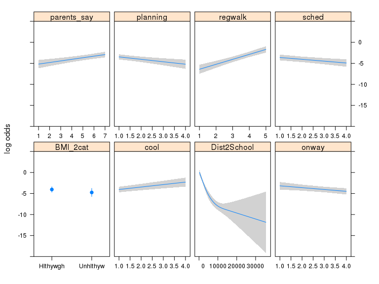

