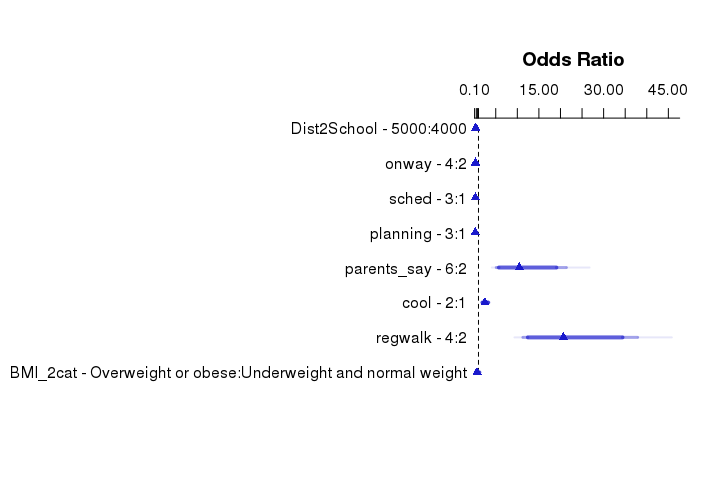
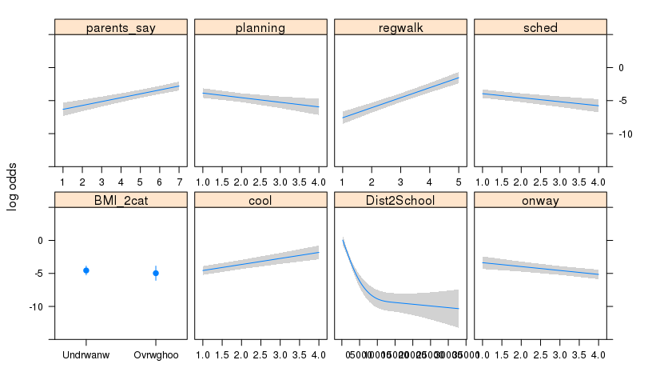

# Notes to the research team
This file contains two things:

1. A record of the analyses that I've done, with full details of the statistical
results.  More details can be shown on request
2. Snippets that can be copied and pasted into manuscripts.  (Note the abstract 
is at the end because the numbers in the abstract rely on code occurs earlier in
this file.)

All analyses were performed using **R**, ver. 3.2.3 [@R15] with packages 
rms, ver. 4.4-1 [@rms15] for  analysis; 
Gmisc, ver. 1.3.1 for plot and table output; and 
knitr, ver 1.12.3 [@xie14] for reproducible research.

## Reproducible research
This file is automatically generated, i.e. all the in-text numbers, tables and
graphs are generated from the data.  If the data file changes, or we decide to 
analyse a different subset of the data, or include or exclude certain variables,
the content in  the document will change automatically (almost), i.e. without
the need to re-type anything.

"Weaving" text, code and results together and rendering them into a document is 
known as "reproducible research", i.e. there is code in the source file that 
reads the data and performs the analysis, then generates the document. This 
makes your research report more tightly bound to the data, and makes it less 
likely that you will be unable to reproduce or extend your research in the 
future if the need arises (as it often does, in my experience). You can open 
the file with the same name as this one, but the extension ".Rmd" 
to see the  source file which is compiled into HTML by **R**. 

This approach can also generate PDF (which some journals accept), but as yet 
there is no one-step  method for rendering directly to an editable format, e.g. 
odt, rtf or docx. But  it's easy to simply copy and paste from your web-browser 
into your word-processor. But of course you should not do this until everyone
involved  with the manuscript preparation is happy that the results are 100% 
finalised!

## Data Setup
The **R** code below is just to show which data file is being used.


```r
dir <- "/home/john/Dropbox/Research/Collaboration/BEATS/John/W2S"
# file <- 'BEATS_SS_ForWalk2School_150507.sav'
file <- "BEATS_SS_ForWalk2School_160201_COMPLETEdata.sav"
```


# Introduction

We know from previous work (and common sense!) that the most influential 
correlate is distance from school. But once that is factored out, what else is 
influential?


The figure above shows the empirical probability of walking to school, i.e. the 
proportion of respondents walk at each level of distance to school. The 
observations plotted are those respondents who live less than 
10,000m from school to make the plot more interpretable. The blue 
line is a Generalised Additive Model smoother.  


Of the  44 students who live less than 469m from 
school, all  walk to school. Of the 550 who live less than 
3100m, 50% walk.  Finally, of the 397 students who live
more than 5800m from school, none of them walk to school.

# Sample description

## Exclusion of cases and missing value analysis

The analyses below are restricted to the students who are not boarders. There are
835 students who fit those criteria. 
The table below shows the number of missing values on variables to be included 
in the multivariate  analyses, which reduce the available sample size.

<center>
<table class='gmisc_table' style='border-collapse: collapse; margin-top: 1em; margin-bottom: 1em;'  id='table_1'>
<thead>
<tr><td colspan='2' style='text-align: left;'>
Table 1:  Missing values for 835 cases</td></tr>
<tr>
<th style='border-bottom: 1px solid grey; border-top: 2px solid grey; text-align: center;'>Variable</th>
<th style='border-bottom: 1px solid grey; border-top: 2px solid grey; text-align: center;'>Missing</th>
</tr>
</thead>
<tbody>
<tr>
<td style='text-align: left;'>regwalk</td>
<td style='text-align: right;'>342</td>
</tr>
<tr>
<td style='text-align: left;'>PAGuideQ</td>
<td style='text-align: right;'>282</td>
</tr>
<tr>
<td style='text-align: left;'>ScrGuide</td>
<td style='text-align: right;'>282</td>
</tr>
<tr>
<td style='text-align: left;'>ATS_f</td>
<td style='text-align: right;'>235</td>
</tr>
<tr>
<td style='text-align: left;'>NGEsthetics</td>
<td style='text-align: right;'>215</td>
</tr>
<tr>
<td style='text-align: left;'>siblings</td>
<td style='text-align: right;'>199</td>
</tr>
<tr>
<td style='text-align: left;'>NEStConnect</td>
<td style='text-align: right;'>176</td>
</tr>
<tr>
<td style='text-align: left;'>BMI_4cat</td>
<td style='text-align: right;'>167</td>
</tr>
<tr>
<td style='text-align: left;'>NZDepCat3</td>
<td style='text-align: right;'>97</td>
</tr>
<tr>
<td style='text-align: left;'>Dist2School</td>
<td style='text-align: right;'>79</td>
</tr>
<tr>
<td style='text-align: left;'>confd</td>
<td style='text-align: right;'>79</td>
</tr>
<tr>
<td style='text-align: left;'>control</td>
<td style='text-align: right;'>79</td>
</tr>
<tr>
<td style='text-align: left;'>intention</td>
<td style='text-align: right;'>79</td>
</tr>
<tr>
<td style='text-align: left;'>parents_walk</td>
<td style='text-align: right;'>79</td>
</tr>
<tr>
<td style='text-align: left;'>parents_say</td>
<td style='text-align: right;'>79</td>
</tr>
<tr>
<td style='text-align: left;'>friends_say</td>
<td style='text-align: right;'>79</td>
</tr>
<tr>
<td style='text-align: left;'>interesting</td>
<td style='text-align: right;'>73</td>
</tr>
<tr>
<td style='text-align: left;'>pleasant</td>
<td style='text-align: right;'>73</td>
</tr>
<tr>
<td style='text-align: left;'>boring</td>
<td style='text-align: right;'>73</td>
</tr>
<tr>
<td style='text-align: left;'>healthy</td>
<td style='text-align: right;'>73</td>
</tr>
<tr>
<td style='text-align: left;'>useful</td>
<td style='text-align: right;'>73</td>
</tr>
<tr>
<td style='text-align: left;'>safe</td>
<td style='text-align: right;'>73</td>
</tr>
<tr>
<td style='text-align: left;'>exercise</td>
<td style='text-align: right;'>73</td>
</tr>
<tr>
<td style='text-align: left;'>onway</td>
<td style='text-align: right;'>73</td>
</tr>
<tr>
<td style='text-align: left;'>time</td>
<td style='text-align: right;'>73</td>
</tr>
<tr>
<td style='text-align: left;'>stuff</td>
<td style='text-align: right;'>73</td>
</tr>
<tr>
<td style='text-align: left;'>sched</td>
<td style='text-align: right;'>73</td>
</tr>
<tr>
<td style='text-align: left;'>planning</td>
<td style='text-align: right;'>73</td>
</tr>
<tr>
<td style='text-align: left;'>sweaty</td>
<td style='text-align: right;'>73</td>
</tr>
<tr>
<td style='text-align: left;'>unsafe</td>
<td style='text-align: right;'>73</td>
</tr>
<tr>
<td style='text-align: left;'>tired</td>
<td style='text-align: right;'>73</td>
</tr>
<tr>
<td style='text-align: left;'>desire</td>
<td style='text-align: right;'>73</td>
</tr>
<tr>
<td style='text-align: left;'>parents_safe</td>
<td style='text-align: right;'>73</td>
</tr>
<tr>
<td style='text-align: left;'>school_says</td>
<td style='text-align: right;'>73</td>
</tr>
<tr>
<td style='text-align: left;'>cool</td>
<td style='text-align: right;'>73</td>
</tr>
<tr>
<td style='text-align: left;'>friends_dont</td>
<td style='text-align: right;'>73</td>
</tr>
<tr>
<td style='text-align: left;'>weather</td>
<td style='text-align: right;'>73</td>
</tr>
<tr>
<td style='text-align: left;'>boring_r</td>
<td style='text-align: right;'>73</td>
</tr>
<tr>
<td style='text-align: left;'>hills</td>
<td style='text-align: right;'>73</td>
</tr>
<tr>
<td style='text-align: left;'>Age_at_Survey</td>
<td style='text-align: right;'>72</td>
</tr>
<tr>
<td style='text-align: left;'>ID</td>
<td style='text-align: right;'>70</td>
</tr>
<tr>
<td style='text-align: left;'>school</td>
<td style='text-align: right;'>70</td>
</tr>
<tr>
<td style='text-align: left;'>gender</td>
<td style='text-align: right;'>70</td>
</tr>
<tr>
<td style='text-align: left;'>HMcars</td>
<td style='text-align: right;'>70</td>
</tr>
<tr>
<td style='text-align: left;'>whodecides</td>
<td style='text-align: right;'>70</td>
</tr>
<tr>
<td style='text-align: left;'>schiclose</td>
<td style='text-align: right;'>70</td>
</tr>
<tr>
<td style='text-align: left;'>school_decile_n</td>
<td style='text-align: right;'>70</td>
</tr>
<tr>
<td style='text-align: left;'>adults</td>
<td style='text-align: right;'>70</td>
</tr>
<tr>
<td style='text-align: left;'>n_cars</td>
<td style='text-align: right;'>70</td>
</tr>
<tr>
<td style='text-align: left;'>eth3</td>
<td style='text-align: right;'>70</td>
</tr>
<tr>
<td style='text-align: left;'>TscWalk</td>
<td style='text-align: right;'>70</td>
</tr>
<tr>
<td style='text-align: left;'>TscCarOth</td>
<td style='text-align: right;'>70</td>
</tr>
<tr>
<td style='text-align: left;'>TscCarMy</td>
<td style='text-align: right;'>70</td>
</tr>
<tr>
<td style='text-align: left;'>TscBusPub</td>
<td style='text-align: right;'>70</td>
</tr>
<tr>
<td style='text-align: left;'>TscBusSc</td>
<td style='text-align: right;'>70</td>
</tr>
<tr>
<td style='text-align: left;'>TSlike</td>
<td style='text-align: right;'>70</td>
</tr>
<tr>
<td style='text-align: left;'>ATS</td>
<td style='text-align: right;'>70</td>
</tr>
<tr>
<td style='text-align: left;'>cars3</td>
<td style='text-align: right;'>70</td>
</tr>
<tr>
<td style='border-bottom: 2px solid grey; text-align: left;'>tsdecision</td>
<td style='border-bottom: 2px solid grey; text-align: right;'>70</td>
</tr>
</tbody>
</table>
</center>

The variables with 11 cases missing are due to participants not completing a 
section of the questionnaire (due to time constraints?).  Not all students
consented to, or had time available for, anthropometry, so many of these values 
are missing. It's not clear to me why there are so many missing values for the 
other variables though.

A total of     835 adolescents were 
included in the analysis (Age
15.2 ± 
1.5 years; 
NA% boys; 
74.4% New Zealand European; 
NA% normal weight). 
The most common modes of transport to school was being driven by others 
(45.9%) 
followed by walking 
(36.3%), 
school bus (6.4%), 
public bus (3.8%)
and driving themselves 
(5.4%).
Overall, 
36.3%
of adolescents used motorized transport only, 
0% 
W2S, and 
63.7% 
used a combination of motorized and active transport to school. Most students 
(93.4%) 
liked the way they travelled to school. 


## Potential correlates 
Socio-demographic characteristics of students who walked versus did not walk to 
school are presented in Tables 2, 3 and 4.

<center>

```
Error in `[.data.frame`(d, , y.name): undefined columns selected
```

<table class='gmisc_table' style='border-collapse: collapse; margin-top: 1em; margin-bottom: 1em;'  id='Table1'>
<thead>
<tr><td colspan='5' style='text-align: left;'>
Table 2:  Demographic characteristics of the sample.</td></tr>
<tr>
<th style='font-weight: 900; border-bottom: 1px solid grey; border-top: 2px solid grey; text-align: center;'>Variable<sup>&dagger;</sup></th>
<th style='border-bottom: 1px solid grey; border-top: 2px solid grey; text-align: center;'>Total<br /> No. 1,232</th>
<th style='border-bottom: 1px solid grey; border-top: 2px solid grey; text-align: center;'>Don't walk<br /> No. 895</th>
<th style='border-bottom: 1px solid grey; border-top: 2px solid grey; text-align: center;'>Walk<br /> No. 337</th>
<th style='border-bottom: 1px solid grey; border-top: 2px solid grey; text-align: center;'>P-value</th>
</tr>
</thead>
<tbody>
<tr>
<td style='text-align: left;'>School decile</td>
<td style='text-align: center;'>3.6 (&plusmn;1.8)</td>
<td style='text-align: center;'>3.7 (&plusmn;1.8)</td>
<td style='text-align: center;'>3.2 (&plusmn;1.8)</td>
<td style='text-align: center;'>&lt; 0.0001</td>
</tr>
<tr>
<td style='text-align: left;'>Distance to school from home</td>
<td style='text-align: center;'>6135.4 (&plusmn;7435.9)</td>
<td style='text-align: center;'>7944.5 (&plusmn;8003.8)</td>
<td style='text-align: center;'>1379.1 (&plusmn;1019.7)</td>
<td style='text-align: center;'>&lt; 0.0001</td>
</tr>
<tr>
<td style='text-align: left;'>Number of siblings at home</td>
<td style='text-align: center;'>2.8 (&plusmn;1.1)</td>
<td style='text-align: center;'>2.8 (&plusmn;1.0)</td>
<td style='text-align: center;'>2.8 (&plusmn;1.1)</td>
<td style='text-align: center;'>0.69</td>
</tr>
<tr>
<td style='text-align: left;'>Walking to school is interesting</td>
<td style='text-align: center;'>4.0 (&plusmn;1.7)</td>
<td style='text-align: center;'>3.8 (&plusmn;1.8)</td>
<td style='text-align: center;'>4.7 (&plusmn;1.5)</td>
<td style='text-align: center;'>&lt; 0.0001</td>
</tr>
<tr>
<td style='text-align: left;'>Walking to school is pleasant</td>
<td style='text-align: center;'>4.1 (&plusmn;1.8)</td>
<td style='text-align: center;'>3.7 (&plusmn;1.8)</td>
<td style='text-align: center;'>4.9 (&plusmn;1.6)</td>
<td style='text-align: center;'>&lt; 0.0001</td>
</tr>
<tr>
<td style='text-align: left;'>Walking to school is boring</td>
<td style='text-align: center;'>3.8 (&plusmn;1.7)</td>
<td style='text-align: center;'>3.6 (&plusmn;1.7)</td>
<td style='text-align: center;'>4.4 (&plusmn;1.6)</td>
<td style='text-align: center;'>&lt; 0.0001</td>
</tr>
<tr>
<td style='text-align: left;'>Walking to school is healthy</td>
<td style='text-align: center;'>5.7 (&plusmn;1.7)</td>
<td style='text-align: center;'>5.6 (&plusmn;1.7)</td>
<td style='text-align: center;'>5.8 (&plusmn;1.5)</td>
<td style='text-align: center;'>0.022</td>
</tr>
<tr>
<td style='text-align: left;'>Walking to school is useful</td>
<td style='text-align: center;'>4.4 (&plusmn;1.9)</td>
<td style='text-align: center;'>4.1 (&plusmn;1.9)</td>
<td style='text-align: center;'>5.3 (&plusmn;1.6)</td>
<td style='text-align: center;'>&lt; 0.0001</td>
</tr>
<tr>
<td style='text-align: left;'>Walking to school is safe</td>
<td style='text-align: center;'>4.3 (&plusmn;1.9)</td>
<td style='text-align: center;'>3.9 (&plusmn;1.9)</td>
<td style='text-align: center;'>5.3 (&plusmn;1.6)</td>
<td style='text-align: center;'>&lt; 0.0001</td>
</tr>
<tr>
<td style='text-align: left;'>Walking is a way to get exercise</td>
<td style='text-align: center;'>3.3 (&plusmn;0.8)</td>
<td style='text-align: center;'>3.3 (&plusmn;0.8)</td>
<td style='text-align: center;'>3.4 (&plusmn;0.8)</td>
<td style='text-align: center;'>0.012</td>
</tr>
<tr>
<td style='text-align: left;'>School is on the way to somewhere</td>
<td style='text-align: center;'>2.9 (&plusmn;1.2)</td>
<td style='text-align: center;'>3.3 (&plusmn;1.0)</td>
<td style='text-align: center;'>1.8 (&plusmn;1.0)</td>
<td style='text-align: center;'>&lt; 0.0001</td>
</tr>
<tr>
<td style='text-align: left;'>Walking takes too much time</td>
<td style='text-align: center;'>2.9 (&plusmn;1.2)</td>
<td style='text-align: center;'>3.4 (&plusmn;0.9)</td>
<td style='text-align: center;'>1.7 (&plusmn;0.9)</td>
<td style='text-align: center;'>&lt; 0.0001</td>
</tr>
<tr>
<td style='text-align: left;'>I have too much stuff</td>
<td style='text-align: center;'>2.7 (&plusmn;1.1)</td>
<td style='text-align: center;'>3.0 (&plusmn;1.0)</td>
<td style='text-align: center;'>2.0 (&plusmn;1.0)</td>
<td style='text-align: center;'>&lt; 0.0001</td>
</tr>
<tr>
<td style='text-align: left;'>After-school schedule</td>
<td style='text-align: center;'>2.4 (&plusmn;1.1)</td>
<td style='text-align: center;'>2.7 (&plusmn;1.0)</td>
<td style='text-align: center;'>1.5 (&plusmn;0.8)</td>
<td style='text-align: center;'>&lt; 0.0001</td>
</tr>
<tr>
<td style='text-align: left;'>Takes too much planning</td>
<td style='text-align: center;'>2.0 (&plusmn;1.0)</td>
<td style='text-align: center;'>2.3 (&plusmn;1.0)</td>
<td style='text-align: center;'>1.2 (&plusmn;0.5)</td>
<td style='text-align: center;'>&lt; 0.0001</td>
</tr>
<tr>
<td style='text-align: left;'>Makes me sweat</td>
<td style='text-align: center;'>2.2 (&plusmn;1.0)</td>
<td style='text-align: center;'>2.4 (&plusmn;1.0)</td>
<td style='text-align: center;'>1.6 (&plusmn;0.9)</td>
<td style='text-align: center;'>&lt; 0.0001</td>
</tr>
<tr>
<td style='text-align: left;'>Not safe</td>
<td style='text-align: center;'>2.0 (&plusmn;1.1)</td>
<td style='text-align: center;'>2.2 (&plusmn;1.1)</td>
<td style='text-align: center;'>1.3 (&plusmn;0.6)</td>
<td style='text-align: center;'>&lt; 0.0001</td>
</tr>
<tr>
<td style='text-align: left;'>Often too tired</td>
<td style='text-align: center;'>2.5 (&plusmn;1.1)</td>
<td style='text-align: center;'>2.7 (&plusmn;1.0)</td>
<td style='text-align: center;'>2.0 (&plusmn;1.0)</td>
<td style='text-align: center;'>&lt; 0.0001</td>
</tr>
<tr>
<td style='text-align: left;'>I want to walk to school</td>
<td style='text-align: center;'>2.3 (&plusmn;1.1)</td>
<td style='text-align: center;'>2.6 (&plusmn;1.1)</td>
<td style='text-align: center;'>1.6 (&plusmn;0.9)</td>
<td style='text-align: center;'>&lt; 0.0001</td>
</tr>
<tr>
<td style='text-align: left;'>I am confident I can walk</td>
<td style='text-align: center;'>4.7 (&plusmn;2.4)</td>
<td style='text-align: center;'>4.0 (&plusmn;2.4)</td>
<td style='text-align: center;'>6.6 (&plusmn;1.0)</td>
<td style='text-align: center;'>&lt; 0.0001</td>
</tr>
<tr>
<td style='text-align: left;'>I am in control of travel mode</td>
<td style='text-align: center;'>5.0 (&plusmn;2.0)</td>
<td style='text-align: center;'>5.0 (&plusmn;2.0)</td>
<td style='text-align: center;'>4.9 (&plusmn;2.1)</td>
<td style='text-align: center;'>0.51</td>
</tr>
<tr>
<td style='text-align: left;'>I intend to walk to school</td>
<td style='text-align: center;'>3.2 (&plusmn;2.5)</td>
<td style='text-align: center;'>1.9 (&plusmn;1.5)</td>
<td style='text-align: center;'>6.5 (&plusmn;1.1)</td>
<td style='text-align: center;'>&lt; 0.0001</td>
</tr>
<tr>
<td style='text-align: left;'>Number of adults at home</td>
<td style='text-align: center;'>1.9 (&plusmn;0.6)</td>
<td style='text-align: center;'>1.9 (&plusmn;0.6)</td>
<td style='text-align: center;'>1.8 (&plusmn;0.7)</td>
<td style='text-align: center;'>0.006</td>
</tr>
<tr>
<td style='text-align: left;'>Number of cars at home</td>
<td style='text-align: center;'>3.0 (&plusmn;1.0)</td>
<td style='text-align: center;'>3.2 (&plusmn;1.0)</td>
<td style='text-align: center;'>2.6 (&plusmn;0.9)</td>
<td style='text-align: center;'>&lt; 0.0001</td>
</tr>
<tr>
<td style='text-align: left;'>My parents walk regularly</td>
<td style='text-align: center;'>3.1 (&plusmn;2.1)</td>
<td style='text-align: center;'>2.9 (&plusmn;2.1)</td>
<td style='text-align: center;'>3.5 (&plusmn;2.3)</td>
<td style='text-align: center;'>&lt; 0.0001</td>
</tr>
<tr>
<td style='text-align: left;'>My parents think its not safe</td>
<td style='text-align: center;'>1.9 (&plusmn;1.1)</td>
<td style='text-align: center;'>2.2 (&plusmn;1.1)</td>
<td style='text-align: center;'>1.2 (&plusmn;0.5)</td>
<td style='text-align: center;'>&lt; 0.0001</td>
</tr>
<tr>
<td style='text-align: left;'>My parents enourage me to walk</td>
<td style='text-align: center;'>4.0 (&plusmn;2.3)</td>
<td style='text-align: center;'>3.1 (&plusmn;2.0)</td>
<td style='text-align: center;'>6.3 (&plusmn;1.3)</td>
<td style='text-align: center;'>&lt; 0.0001</td>
</tr>
<tr>
<td style='text-align: left;'>My friends enourage me to walk</td>
<td style='text-align: center;'>3.7 (&plusmn;2.0)</td>
<td style='text-align: center;'>3.0 (&plusmn;1.8)</td>
<td style='text-align: center;'>5.4 (&plusmn;1.5)</td>
<td style='text-align: center;'>&lt; 0.0001</td>
</tr>
<tr>
<td style='text-align: left;'>My school enourages me to walk</td>
<td style='text-align: center;'>2.0 (&plusmn;0.9)</td>
<td style='text-align: center;'>1.9 (&plusmn;0.9)</td>
<td style='text-align: center;'>2.1 (&plusmn;0.9)</td>
<td style='text-align: center;'>0.009</td>
</tr>
<tr>
<td style='text-align: left;'>It's not cool to walk</td>
<td style='text-align: center;'>1.5 (&plusmn;0.8)</td>
<td style='text-align: center;'>1.6 (&plusmn;0.8)</td>
<td style='text-align: center;'>1.3 (&plusmn;0.6)</td>
<td style='text-align: center;'>&lt; 0.0001</td>
</tr>
<tr>
<td style='text-align: left;'>My friends don't walk</td>
<td style='text-align: center;'>2.1 (&plusmn;1.1)</td>
<td style='text-align: center;'>2.4 (&plusmn;1.1)</td>
<td style='text-align: center;'>1.4 (&plusmn;0.7)</td>
<td style='text-align: center;'>&lt; 0.0001</td>
</tr>
<tr>
<td style='text-align: left;'>The weather is to bad</td>
<td style='text-align: center;'>2.7 (&plusmn;0.9)</td>
<td style='text-align: center;'>2.8 (&plusmn;0.9)</td>
<td style='text-align: center;'>2.3 (&plusmn;0.9)</td>
<td style='text-align: center;'>&lt; 0.0001</td>
</tr>
<tr>
<td style='text-align: left;'>The route to school is boring</td>
<td style='text-align: center;'>2.1 (&plusmn;1.0)</td>
<td style='text-align: center;'>2.2 (&plusmn;1.0)</td>
<td style='text-align: center;'>1.9 (&plusmn;1.0)</td>
<td style='text-align: center;'>&lt; 0.0001</td>
</tr>
<tr>
<td style='text-align: left;'>There are too many hills on the route</td>
<td style='text-align: center;'>2.4 (&plusmn;1.1)</td>
<td style='text-align: center;'>2.6 (&plusmn;1.1)</td>
<td style='text-align: center;'>1.7 (&plusmn;0.9)</td>
<td style='text-align: center;'>&lt; 0.0001</td>
</tr>
<tr>
<td style='text-align: left;'>Walking for general mobility</td>
<td style='text-align: center;'>2.9 (&plusmn;1.2)</td>
<td style='text-align: center;'>2.5 (&plusmn;1.0)</td>
<td style='text-align: center;'>3.9 (&plusmn;0.9)</td>
<td style='text-align: center;'>&lt; 0.0001</td>
</tr>
<tr>
<td style='text-align: left;'>Connectivity</td>
<td style='text-align: center;'>2.6 (&plusmn;0.7)</td>
<td style='text-align: center;'>2.6 (&plusmn;0.7)</td>
<td style='text-align: center;'>2.8 (&plusmn;0.7)</td>
<td style='text-align: center;'>&lt; 0.0001</td>
</tr>
<tr>
<td style='border-bottom: 2px solid grey; text-align: left;'>Aesthetics</td>
<td style='border-bottom: 2px solid grey; text-align: center;'>2.7 (&plusmn;0.8)</td>
<td style='border-bottom: 2px solid grey; text-align: center;'>2.7 (&plusmn;0.8)</td>
<td style='border-bottom: 2px solid grey; text-align: center;'>2.6 (&plusmn;0.8)</td>
<td style='border-bottom: 2px solid grey; text-align: center;'>0.11</td>
</tr>
</tbody>
<tfoot><tr><td colspan='5'>
<small><sup>&dagger;</sup>Categorical variables are reported in counts and percentages: count (%). The <i>p</i>-values are from Fisher tests. Proportions are calculated horizontally. Continuous variables are reported as mean (±SD). The <i>p</i>-values are from Wilcoxon tests.</small></td></tr></tfoot>
</table>
</center>

The tables below are not intended for inclusion in manuscripts, they are just 
here for reference in case we decide to change anything else.

<center>

```
Error in `[.data.frame`(d, , y.name): undefined columns selected
```

<table class='gmisc_table' style='border-collapse: collapse; margin-top: 1em; margin-bottom: 1em;'  id='Table1'>
<thead>
<tr><td colspan='5' style='text-align: left;'>
Table 3:  Categorical individual and household potential correlates of walking to school</td></tr>
<tr>
<th style='font-weight: 900; border-bottom: 1px solid grey; border-top: 2px solid grey; text-align: center;'>Variable<sup>&dagger;</sup></th>
<th style='border-bottom: 1px solid grey; border-top: 2px solid grey; text-align: center;'>Total<br /> No. 1,232</th>
<th style='border-bottom: 1px solid grey; border-top: 2px solid grey; text-align: center;'>Don't walk<br /> No. 895</th>
<th style='border-bottom: 1px solid grey; border-top: 2px solid grey; text-align: center;'>Walk<br /> No. 337</th>
<th style='border-bottom: 1px solid grey; border-top: 2px solid grey; text-align: center;'>P-value</th>
</tr>
</thead>
<tbody>
<tr>
<td style='text-align: left;'>School decile</td>
<td style='text-align: center;'>3.6 (&plusmn;1.8)</td>
<td style='text-align: center;'>3.7 (&plusmn;1.8)</td>
<td style='text-align: center;'>3.2 (&plusmn;1.8)</td>
<td style='text-align: center;'>&lt; 0.0001</td>
</tr>
<tr>
<td style='text-align: left;'>Distance to school from home</td>
<td style='text-align: center;'>6135.4 (&plusmn;7435.9)</td>
<td style='text-align: center;'>7944.5 (&plusmn;8003.8)</td>
<td style='text-align: center;'>1379.1 (&plusmn;1019.7)</td>
<td style='text-align: center;'>&lt; 0.0001</td>
</tr>
<tr>
<td style='text-align: left;'>Number of siblings at home</td>
<td style='text-align: center;'>2.8 (&plusmn;1.1)</td>
<td style='text-align: center;'>2.8 (&plusmn;1.0)</td>
<td style='text-align: center;'>2.8 (&plusmn;1.1)</td>
<td style='text-align: center;'>0.69</td>
</tr>
<tr>
<td style='text-align: left;'>Walking to school is interesting</td>
<td style='text-align: center;'>4.0 (&plusmn;1.7)</td>
<td style='text-align: center;'>3.8 (&plusmn;1.8)</td>
<td style='text-align: center;'>4.7 (&plusmn;1.5)</td>
<td style='text-align: center;'>&lt; 0.0001</td>
</tr>
<tr>
<td style='text-align: left;'>Walking to school is pleasant</td>
<td style='text-align: center;'>4.1 (&plusmn;1.8)</td>
<td style='text-align: center;'>3.7 (&plusmn;1.8)</td>
<td style='text-align: center;'>4.9 (&plusmn;1.6)</td>
<td style='text-align: center;'>&lt; 0.0001</td>
</tr>
<tr>
<td style='text-align: left;'>Walking to school is boring</td>
<td style='text-align: center;'>3.8 (&plusmn;1.7)</td>
<td style='text-align: center;'>3.6 (&plusmn;1.7)</td>
<td style='text-align: center;'>4.4 (&plusmn;1.6)</td>
<td style='text-align: center;'>&lt; 0.0001</td>
</tr>
<tr>
<td style='text-align: left;'>Walking to school is healthy</td>
<td style='text-align: center;'>5.7 (&plusmn;1.7)</td>
<td style='text-align: center;'>5.6 (&plusmn;1.7)</td>
<td style='text-align: center;'>5.8 (&plusmn;1.5)</td>
<td style='text-align: center;'>0.022</td>
</tr>
<tr>
<td style='text-align: left;'>Walking to school is useful</td>
<td style='text-align: center;'>4.4 (&plusmn;1.9)</td>
<td style='text-align: center;'>4.1 (&plusmn;1.9)</td>
<td style='text-align: center;'>5.3 (&plusmn;1.6)</td>
<td style='text-align: center;'>&lt; 0.0001</td>
</tr>
<tr>
<td style='text-align: left;'>Walking to school is safe</td>
<td style='text-align: center;'>4.3 (&plusmn;1.9)</td>
<td style='text-align: center;'>3.9 (&plusmn;1.9)</td>
<td style='text-align: center;'>5.3 (&plusmn;1.6)</td>
<td style='text-align: center;'>&lt; 0.0001</td>
</tr>
<tr>
<td style='text-align: left;'>Walking is a way to get exercise</td>
<td style='text-align: center;'>3.3 (&plusmn;0.8)</td>
<td style='text-align: center;'>3.3 (&plusmn;0.8)</td>
<td style='text-align: center;'>3.4 (&plusmn;0.8)</td>
<td style='text-align: center;'>0.012</td>
</tr>
<tr>
<td style='text-align: left;'>School is on the way to somewhere</td>
<td style='text-align: center;'>2.9 (&plusmn;1.2)</td>
<td style='text-align: center;'>3.3 (&plusmn;1.0)</td>
<td style='text-align: center;'>1.8 (&plusmn;1.0)</td>
<td style='text-align: center;'>&lt; 0.0001</td>
</tr>
<tr>
<td style='text-align: left;'>Walking takes too much time</td>
<td style='text-align: center;'>2.9 (&plusmn;1.2)</td>
<td style='text-align: center;'>3.4 (&plusmn;0.9)</td>
<td style='text-align: center;'>1.7 (&plusmn;0.9)</td>
<td style='text-align: center;'>&lt; 0.0001</td>
</tr>
<tr>
<td style='text-align: left;'>I have too much stuff</td>
<td style='text-align: center;'>2.7 (&plusmn;1.1)</td>
<td style='text-align: center;'>3.0 (&plusmn;1.0)</td>
<td style='text-align: center;'>2.0 (&plusmn;1.0)</td>
<td style='text-align: center;'>&lt; 0.0001</td>
</tr>
<tr>
<td style='text-align: left;'>After-school schedule</td>
<td style='text-align: center;'>2.4 (&plusmn;1.1)</td>
<td style='text-align: center;'>2.7 (&plusmn;1.0)</td>
<td style='text-align: center;'>1.5 (&plusmn;0.8)</td>
<td style='text-align: center;'>&lt; 0.0001</td>
</tr>
<tr>
<td style='text-align: left;'>Takes too much planning</td>
<td style='text-align: center;'>2.0 (&plusmn;1.0)</td>
<td style='text-align: center;'>2.3 (&plusmn;1.0)</td>
<td style='text-align: center;'>1.2 (&plusmn;0.5)</td>
<td style='text-align: center;'>&lt; 0.0001</td>
</tr>
<tr>
<td style='text-align: left;'>Makes me sweat</td>
<td style='text-align: center;'>2.2 (&plusmn;1.0)</td>
<td style='text-align: center;'>2.4 (&plusmn;1.0)</td>
<td style='text-align: center;'>1.6 (&plusmn;0.9)</td>
<td style='text-align: center;'>&lt; 0.0001</td>
</tr>
<tr>
<td style='text-align: left;'>Not safe</td>
<td style='text-align: center;'>2.0 (&plusmn;1.1)</td>
<td style='text-align: center;'>2.2 (&plusmn;1.1)</td>
<td style='text-align: center;'>1.3 (&plusmn;0.6)</td>
<td style='text-align: center;'>&lt; 0.0001</td>
</tr>
<tr>
<td style='text-align: left;'>Often too tired</td>
<td style='text-align: center;'>2.5 (&plusmn;1.1)</td>
<td style='text-align: center;'>2.7 (&plusmn;1.0)</td>
<td style='text-align: center;'>2.0 (&plusmn;1.0)</td>
<td style='text-align: center;'>&lt; 0.0001</td>
</tr>
<tr>
<td style='text-align: left;'>I want to walk to school</td>
<td style='text-align: center;'>2.3 (&plusmn;1.1)</td>
<td style='text-align: center;'>2.6 (&plusmn;1.1)</td>
<td style='text-align: center;'>1.6 (&plusmn;0.9)</td>
<td style='text-align: center;'>&lt; 0.0001</td>
</tr>
<tr>
<td style='text-align: left;'>I am confident I can walk</td>
<td style='text-align: center;'>4.7 (&plusmn;2.4)</td>
<td style='text-align: center;'>4.0 (&plusmn;2.4)</td>
<td style='text-align: center;'>6.6 (&plusmn;1.0)</td>
<td style='text-align: center;'>&lt; 0.0001</td>
</tr>
<tr>
<td style='text-align: left;'>I am in control of travel mode</td>
<td style='text-align: center;'>5.0 (&plusmn;2.0)</td>
<td style='text-align: center;'>5.0 (&plusmn;2.0)</td>
<td style='text-align: center;'>4.9 (&plusmn;2.1)</td>
<td style='text-align: center;'>0.51</td>
</tr>
<tr>
<td style='text-align: left;'>I intend to walk to school</td>
<td style='text-align: center;'>3.2 (&plusmn;2.5)</td>
<td style='text-align: center;'>1.9 (&plusmn;1.5)</td>
<td style='text-align: center;'>6.5 (&plusmn;1.1)</td>
<td style='text-align: center;'>&lt; 0.0001</td>
</tr>
<tr>
<td style='text-align: left;'>Number of adults at home</td>
<td style='text-align: center;'>1.9 (&plusmn;0.6)</td>
<td style='text-align: center;'>1.9 (&plusmn;0.6)</td>
<td style='text-align: center;'>1.8 (&plusmn;0.7)</td>
<td style='text-align: center;'>0.006</td>
</tr>
<tr>
<td style='text-align: left;'>Number of cars at home</td>
<td style='text-align: center;'>3.0 (&plusmn;1.0)</td>
<td style='text-align: center;'>3.2 (&plusmn;1.0)</td>
<td style='text-align: center;'>2.6 (&plusmn;0.9)</td>
<td style='text-align: center;'>&lt; 0.0001</td>
</tr>
<tr>
<td style='text-align: left;'>My parents walk regularly</td>
<td style='text-align: center;'>3.1 (&plusmn;2.1)</td>
<td style='text-align: center;'>2.9 (&plusmn;2.1)</td>
<td style='text-align: center;'>3.5 (&plusmn;2.3)</td>
<td style='text-align: center;'>&lt; 0.0001</td>
</tr>
<tr>
<td style='text-align: left;'>My parents think its not safe</td>
<td style='text-align: center;'>1.9 (&plusmn;1.1)</td>
<td style='text-align: center;'>2.2 (&plusmn;1.1)</td>
<td style='text-align: center;'>1.2 (&plusmn;0.5)</td>
<td style='text-align: center;'>&lt; 0.0001</td>
</tr>
<tr>
<td style='text-align: left;'>My parents enourage me to walk</td>
<td style='text-align: center;'>4.0 (&plusmn;2.3)</td>
<td style='text-align: center;'>3.1 (&plusmn;2.0)</td>
<td style='text-align: center;'>6.3 (&plusmn;1.3)</td>
<td style='text-align: center;'>&lt; 0.0001</td>
</tr>
<tr>
<td style='text-align: left;'>My friends enourage me to walk</td>
<td style='text-align: center;'>3.7 (&plusmn;2.0)</td>
<td style='text-align: center;'>3.0 (&plusmn;1.8)</td>
<td style='text-align: center;'>5.4 (&plusmn;1.5)</td>
<td style='text-align: center;'>&lt; 0.0001</td>
</tr>
<tr>
<td style='text-align: left;'>My school enourages me to walk</td>
<td style='text-align: center;'>2.0 (&plusmn;0.9)</td>
<td style='text-align: center;'>1.9 (&plusmn;0.9)</td>
<td style='text-align: center;'>2.1 (&plusmn;0.9)</td>
<td style='text-align: center;'>0.009</td>
</tr>
<tr>
<td style='text-align: left;'>It's not cool to walk</td>
<td style='text-align: center;'>1.5 (&plusmn;0.8)</td>
<td style='text-align: center;'>1.6 (&plusmn;0.8)</td>
<td style='text-align: center;'>1.3 (&plusmn;0.6)</td>
<td style='text-align: center;'>&lt; 0.0001</td>
</tr>
<tr>
<td style='text-align: left;'>My friends don't walk</td>
<td style='text-align: center;'>2.1 (&plusmn;1.1)</td>
<td style='text-align: center;'>2.4 (&plusmn;1.1)</td>
<td style='text-align: center;'>1.4 (&plusmn;0.7)</td>
<td style='text-align: center;'>&lt; 0.0001</td>
</tr>
<tr>
<td style='text-align: left;'>The weather is to bad</td>
<td style='text-align: center;'>2.7 (&plusmn;0.9)</td>
<td style='text-align: center;'>2.8 (&plusmn;0.9)</td>
<td style='text-align: center;'>2.3 (&plusmn;0.9)</td>
<td style='text-align: center;'>&lt; 0.0001</td>
</tr>
<tr>
<td style='text-align: left;'>The route to school is boring</td>
<td style='text-align: center;'>2.1 (&plusmn;1.0)</td>
<td style='text-align: center;'>2.2 (&plusmn;1.0)</td>
<td style='text-align: center;'>1.9 (&plusmn;1.0)</td>
<td style='text-align: center;'>&lt; 0.0001</td>
</tr>
<tr>
<td style='text-align: left;'>There are too many hills on the route</td>
<td style='text-align: center;'>2.4 (&plusmn;1.1)</td>
<td style='text-align: center;'>2.6 (&plusmn;1.1)</td>
<td style='text-align: center;'>1.7 (&plusmn;0.9)</td>
<td style='text-align: center;'>&lt; 0.0001</td>
</tr>
<tr>
<td style='text-align: left;'>Walking for general mobility</td>
<td style='text-align: center;'>2.9 (&plusmn;1.2)</td>
<td style='text-align: center;'>2.5 (&plusmn;1.0)</td>
<td style='text-align: center;'>3.9 (&plusmn;0.9)</td>
<td style='text-align: center;'>&lt; 0.0001</td>
</tr>
<tr>
<td style='text-align: left;'>Connectivity</td>
<td style='text-align: center;'>2.6 (&plusmn;0.7)</td>
<td style='text-align: center;'>2.6 (&plusmn;0.7)</td>
<td style='text-align: center;'>2.8 (&plusmn;0.7)</td>
<td style='text-align: center;'>&lt; 0.0001</td>
</tr>
<tr>
<td style='border-bottom: 2px solid grey; text-align: left;'>Aesthetics</td>
<td style='border-bottom: 2px solid grey; text-align: center;'>2.7 (&plusmn;0.8)</td>
<td style='border-bottom: 2px solid grey; text-align: center;'>2.7 (&plusmn;0.8)</td>
<td style='border-bottom: 2px solid grey; text-align: center;'>2.6 (&plusmn;0.8)</td>
<td style='border-bottom: 2px solid grey; text-align: center;'>0.11</td>
</tr>
</tbody>
<tfoot><tr><td colspan='5'>
<small><sup>&dagger;</sup>Variables are reported in counts and percentages: count (%). The <i>p</i>-values are from Fisher tests. The total proportions are calculated vertically, and the others are calulated horizontally.</small></td></tr></tfoot>
</table>
</center>

&nbsp;

<center>

```
Error in `[.data.frame`(d, , y.name): undefined columns selected
```

<table class='gmisc_table' style='border-collapse: collapse; margin-top: 1em; margin-bottom: 1em;'  id='Table1'>
<thead>
<tr><td colspan='5' style='text-align: left;'>
Table 4:  Continuous individual potential correlates of walking to school</td></tr>
<tr>
<th style='font-weight: 900; border-bottom: 1px solid grey; border-top: 2px solid grey; text-align: center;'>Variable<sup>&dagger;</sup></th>
<th style='border-bottom: 1px solid grey; border-top: 2px solid grey; text-align: center;'>Total<br /> No. 1,232</th>
<th style='border-bottom: 1px solid grey; border-top: 2px solid grey; text-align: center;'>Don't walk<br /> No. 895</th>
<th style='border-bottom: 1px solid grey; border-top: 2px solid grey; text-align: center;'>Walk<br /> No. 337</th>
<th style='border-bottom: 1px solid grey; border-top: 2px solid grey; text-align: center;'>P-value</th>
</tr>
</thead>
<tbody>
<tr>
<td style='text-align: left;'>School decile</td>
<td style='text-align: center;'>3.6 (&plusmn;1.8)</td>
<td style='text-align: center;'>3.7 (&plusmn;1.8)</td>
<td style='text-align: center;'>3.2 (&plusmn;1.8)</td>
<td style='text-align: center;'>&lt; 0.0001</td>
</tr>
<tr>
<td style='text-align: left;'>Distance to school from home</td>
<td style='text-align: center;'>6135.4 (&plusmn;7435.9)</td>
<td style='text-align: center;'>7944.5 (&plusmn;8003.8)</td>
<td style='text-align: center;'>1379.1 (&plusmn;1019.7)</td>
<td style='text-align: center;'>&lt; 0.0001</td>
</tr>
<tr>
<td style='text-align: left;'>Number of siblings at home</td>
<td style='text-align: center;'>2.8 (&plusmn;1.1)</td>
<td style='text-align: center;'>2.8 (&plusmn;1.0)</td>
<td style='text-align: center;'>2.8 (&plusmn;1.1)</td>
<td style='text-align: center;'>0.69</td>
</tr>
<tr>
<td style='text-align: left;'>Walking to school is interesting</td>
<td style='text-align: center;'>4.0 (&plusmn;1.7)</td>
<td style='text-align: center;'>3.8 (&plusmn;1.8)</td>
<td style='text-align: center;'>4.7 (&plusmn;1.5)</td>
<td style='text-align: center;'>&lt; 0.0001</td>
</tr>
<tr>
<td style='text-align: left;'>Walking to school is pleasant</td>
<td style='text-align: center;'>4.1 (&plusmn;1.8)</td>
<td style='text-align: center;'>3.7 (&plusmn;1.8)</td>
<td style='text-align: center;'>4.9 (&plusmn;1.6)</td>
<td style='text-align: center;'>&lt; 0.0001</td>
</tr>
<tr>
<td style='text-align: left;'>Walking to school is boring</td>
<td style='text-align: center;'>3.8 (&plusmn;1.7)</td>
<td style='text-align: center;'>3.6 (&plusmn;1.7)</td>
<td style='text-align: center;'>4.4 (&plusmn;1.6)</td>
<td style='text-align: center;'>&lt; 0.0001</td>
</tr>
<tr>
<td style='text-align: left;'>Walking to school is healthy</td>
<td style='text-align: center;'>5.7 (&plusmn;1.7)</td>
<td style='text-align: center;'>5.6 (&plusmn;1.7)</td>
<td style='text-align: center;'>5.8 (&plusmn;1.5)</td>
<td style='text-align: center;'>0.022</td>
</tr>
<tr>
<td style='text-align: left;'>Walking to school is useful</td>
<td style='text-align: center;'>4.4 (&plusmn;1.9)</td>
<td style='text-align: center;'>4.1 (&plusmn;1.9)</td>
<td style='text-align: center;'>5.3 (&plusmn;1.6)</td>
<td style='text-align: center;'>&lt; 0.0001</td>
</tr>
<tr>
<td style='text-align: left;'>Walking to school is safe</td>
<td style='text-align: center;'>4.3 (&plusmn;1.9)</td>
<td style='text-align: center;'>3.9 (&plusmn;1.9)</td>
<td style='text-align: center;'>5.3 (&plusmn;1.6)</td>
<td style='text-align: center;'>&lt; 0.0001</td>
</tr>
<tr>
<td style='text-align: left;'>Walking is a way to get exercise</td>
<td style='text-align: center;'>3.3 (&plusmn;0.8)</td>
<td style='text-align: center;'>3.3 (&plusmn;0.8)</td>
<td style='text-align: center;'>3.4 (&plusmn;0.8)</td>
<td style='text-align: center;'>0.012</td>
</tr>
<tr>
<td style='text-align: left;'>School is on the way to somewhere</td>
<td style='text-align: center;'>2.9 (&plusmn;1.2)</td>
<td style='text-align: center;'>3.3 (&plusmn;1.0)</td>
<td style='text-align: center;'>1.8 (&plusmn;1.0)</td>
<td style='text-align: center;'>&lt; 0.0001</td>
</tr>
<tr>
<td style='text-align: left;'>Walking takes too much time</td>
<td style='text-align: center;'>2.9 (&plusmn;1.2)</td>
<td style='text-align: center;'>3.4 (&plusmn;0.9)</td>
<td style='text-align: center;'>1.7 (&plusmn;0.9)</td>
<td style='text-align: center;'>&lt; 0.0001</td>
</tr>
<tr>
<td style='text-align: left;'>I have too much stuff</td>
<td style='text-align: center;'>2.7 (&plusmn;1.1)</td>
<td style='text-align: center;'>3.0 (&plusmn;1.0)</td>
<td style='text-align: center;'>2.0 (&plusmn;1.0)</td>
<td style='text-align: center;'>&lt; 0.0001</td>
</tr>
<tr>
<td style='text-align: left;'>After-school schedule</td>
<td style='text-align: center;'>2.4 (&plusmn;1.1)</td>
<td style='text-align: center;'>2.7 (&plusmn;1.0)</td>
<td style='text-align: center;'>1.5 (&plusmn;0.8)</td>
<td style='text-align: center;'>&lt; 0.0001</td>
</tr>
<tr>
<td style='text-align: left;'>Takes too much planning</td>
<td style='text-align: center;'>2.0 (&plusmn;1.0)</td>
<td style='text-align: center;'>2.3 (&plusmn;1.0)</td>
<td style='text-align: center;'>1.2 (&plusmn;0.5)</td>
<td style='text-align: center;'>&lt; 0.0001</td>
</tr>
<tr>
<td style='text-align: left;'>Makes me sweat</td>
<td style='text-align: center;'>2.2 (&plusmn;1.0)</td>
<td style='text-align: center;'>2.4 (&plusmn;1.0)</td>
<td style='text-align: center;'>1.6 (&plusmn;0.9)</td>
<td style='text-align: center;'>&lt; 0.0001</td>
</tr>
<tr>
<td style='text-align: left;'>Not safe</td>
<td style='text-align: center;'>2.0 (&plusmn;1.1)</td>
<td style='text-align: center;'>2.2 (&plusmn;1.1)</td>
<td style='text-align: center;'>1.3 (&plusmn;0.6)</td>
<td style='text-align: center;'>&lt; 0.0001</td>
</tr>
<tr>
<td style='text-align: left;'>Often too tired</td>
<td style='text-align: center;'>2.5 (&plusmn;1.1)</td>
<td style='text-align: center;'>2.7 (&plusmn;1.0)</td>
<td style='text-align: center;'>2.0 (&plusmn;1.0)</td>
<td style='text-align: center;'>&lt; 0.0001</td>
</tr>
<tr>
<td style='text-align: left;'>I want to walk to school</td>
<td style='text-align: center;'>2.3 (&plusmn;1.1)</td>
<td style='text-align: center;'>2.6 (&plusmn;1.1)</td>
<td style='text-align: center;'>1.6 (&plusmn;0.9)</td>
<td style='text-align: center;'>&lt; 0.0001</td>
</tr>
<tr>
<td style='text-align: left;'>I am confident I can walk</td>
<td style='text-align: center;'>4.7 (&plusmn;2.4)</td>
<td style='text-align: center;'>4.0 (&plusmn;2.4)</td>
<td style='text-align: center;'>6.6 (&plusmn;1.0)</td>
<td style='text-align: center;'>&lt; 0.0001</td>
</tr>
<tr>
<td style='text-align: left;'>I am in control of travel mode</td>
<td style='text-align: center;'>5.0 (&plusmn;2.0)</td>
<td style='text-align: center;'>5.0 (&plusmn;2.0)</td>
<td style='text-align: center;'>4.9 (&plusmn;2.1)</td>
<td style='text-align: center;'>0.51</td>
</tr>
<tr>
<td style='text-align: left;'>I intend to walk to school</td>
<td style='text-align: center;'>3.2 (&plusmn;2.5)</td>
<td style='text-align: center;'>1.9 (&plusmn;1.5)</td>
<td style='text-align: center;'>6.5 (&plusmn;1.1)</td>
<td style='text-align: center;'>&lt; 0.0001</td>
</tr>
<tr>
<td style='text-align: left;'>Number of adults at home</td>
<td style='text-align: center;'>1.9 (&plusmn;0.6)</td>
<td style='text-align: center;'>1.9 (&plusmn;0.6)</td>
<td style='text-align: center;'>1.8 (&plusmn;0.7)</td>
<td style='text-align: center;'>0.006</td>
</tr>
<tr>
<td style='text-align: left;'>Number of cars at home</td>
<td style='text-align: center;'>3.0 (&plusmn;1.0)</td>
<td style='text-align: center;'>3.2 (&plusmn;1.0)</td>
<td style='text-align: center;'>2.6 (&plusmn;0.9)</td>
<td style='text-align: center;'>&lt; 0.0001</td>
</tr>
<tr>
<td style='text-align: left;'>My parents walk regularly</td>
<td style='text-align: center;'>3.1 (&plusmn;2.1)</td>
<td style='text-align: center;'>2.9 (&plusmn;2.1)</td>
<td style='text-align: center;'>3.5 (&plusmn;2.3)</td>
<td style='text-align: center;'>&lt; 0.0001</td>
</tr>
<tr>
<td style='text-align: left;'>My parents think its not safe</td>
<td style='text-align: center;'>1.9 (&plusmn;1.1)</td>
<td style='text-align: center;'>2.2 (&plusmn;1.1)</td>
<td style='text-align: center;'>1.2 (&plusmn;0.5)</td>
<td style='text-align: center;'>&lt; 0.0001</td>
</tr>
<tr>
<td style='text-align: left;'>My parents enourage me to walk</td>
<td style='text-align: center;'>4.0 (&plusmn;2.3)</td>
<td style='text-align: center;'>3.1 (&plusmn;2.0)</td>
<td style='text-align: center;'>6.3 (&plusmn;1.3)</td>
<td style='text-align: center;'>&lt; 0.0001</td>
</tr>
<tr>
<td style='text-align: left;'>My friends enourage me to walk</td>
<td style='text-align: center;'>3.7 (&plusmn;2.0)</td>
<td style='text-align: center;'>3.0 (&plusmn;1.8)</td>
<td style='text-align: center;'>5.4 (&plusmn;1.5)</td>
<td style='text-align: center;'>&lt; 0.0001</td>
</tr>
<tr>
<td style='text-align: left;'>My school enourages me to walk</td>
<td style='text-align: center;'>2.0 (&plusmn;0.9)</td>
<td style='text-align: center;'>1.9 (&plusmn;0.9)</td>
<td style='text-align: center;'>2.1 (&plusmn;0.9)</td>
<td style='text-align: center;'>0.009</td>
</tr>
<tr>
<td style='text-align: left;'>It's not cool to walk</td>
<td style='text-align: center;'>1.5 (&plusmn;0.8)</td>
<td style='text-align: center;'>1.6 (&plusmn;0.8)</td>
<td style='text-align: center;'>1.3 (&plusmn;0.6)</td>
<td style='text-align: center;'>&lt; 0.0001</td>
</tr>
<tr>
<td style='text-align: left;'>My friends don't walk</td>
<td style='text-align: center;'>2.1 (&plusmn;1.1)</td>
<td style='text-align: center;'>2.4 (&plusmn;1.1)</td>
<td style='text-align: center;'>1.4 (&plusmn;0.7)</td>
<td style='text-align: center;'>&lt; 0.0001</td>
</tr>
<tr>
<td style='text-align: left;'>The weather is to bad</td>
<td style='text-align: center;'>2.7 (&plusmn;0.9)</td>
<td style='text-align: center;'>2.8 (&plusmn;0.9)</td>
<td style='text-align: center;'>2.3 (&plusmn;0.9)</td>
<td style='text-align: center;'>&lt; 0.0001</td>
</tr>
<tr>
<td style='text-align: left;'>The route to school is boring</td>
<td style='text-align: center;'>2.1 (&plusmn;1.0)</td>
<td style='text-align: center;'>2.2 (&plusmn;1.0)</td>
<td style='text-align: center;'>1.9 (&plusmn;1.0)</td>
<td style='text-align: center;'>&lt; 0.0001</td>
</tr>
<tr>
<td style='text-align: left;'>There are too many hills on the route</td>
<td style='text-align: center;'>2.4 (&plusmn;1.1)</td>
<td style='text-align: center;'>2.6 (&plusmn;1.1)</td>
<td style='text-align: center;'>1.7 (&plusmn;0.9)</td>
<td style='text-align: center;'>&lt; 0.0001</td>
</tr>
<tr>
<td style='text-align: left;'>Walking for general mobility</td>
<td style='text-align: center;'>2.9 (&plusmn;1.2)</td>
<td style='text-align: center;'>2.5 (&plusmn;1.0)</td>
<td style='text-align: center;'>3.9 (&plusmn;0.9)</td>
<td style='text-align: center;'>&lt; 0.0001</td>
</tr>
<tr>
<td style='text-align: left;'>Connectivity</td>
<td style='text-align: center;'>2.6 (&plusmn;0.7)</td>
<td style='text-align: center;'>2.6 (&plusmn;0.7)</td>
<td style='text-align: center;'>2.8 (&plusmn;0.7)</td>
<td style='text-align: center;'>&lt; 0.0001</td>
</tr>
<tr>
<td style='border-bottom: 2px solid grey; text-align: left;'>Aesthetics</td>
<td style='border-bottom: 2px solid grey; text-align: center;'>2.7 (&plusmn;0.8)</td>
<td style='border-bottom: 2px solid grey; text-align: center;'>2.7 (&plusmn;0.8)</td>
<td style='border-bottom: 2px solid grey; text-align: center;'>2.6 (&plusmn;0.8)</td>
<td style='border-bottom: 2px solid grey; text-align: center;'>0.11</td>
</tr>
</tbody>
<tfoot><tr><td colspan='5'>
<small><sup>&dagger;</sup>The <i>p</i>-values are from  Wilcoxon tests.</small></td></tr></tfoot>
</table>
</center>

# Modeling
Notes:

- The effect of distance on the probability of walking to school is clearly 
non-linear, so the distance variable was transformed using a restricted cubic 
spline (with three knots).
- Because the data were collected within schools, robust standard errors were 
calculated using school as a cluster variable. 
- Following @hosmer13 [p. 177], models with areas under the  ROC curve greater 
than 0.9 are labelled "outstanding", and those with ROC areas between 0.8 and 
0.9 are labelled "excellent".

## Model 1
Following best practice (not *common* practice), as explained by 
@harrell01 [pp. 56--60], all significant univariate correlates from Table 1 were 
included in the initial model. This model was reduced by removing the correlate 
with the largest *p*-value one at a time and re-inspecting the fit carefully. 

This was not a purely automatic or data-driven process. At each stage, the 
conceptual meaning of the candidate variable for removal was considered.  During 
this process, it became apparent that two of the correlates, **time** and 
**intention** are highly correlated with distance and with each other, even though 
their VIFs are well below 10. Also these variables have little explanatory power 
conceptually. Accordingly they were removed at the earliest stage of model 
simplification.


<center>
<table class='gmisc_table' style='border-collapse: collapse; margin-top: 1em; margin-bottom: 1em;'  id='table_5'>
<thead>
<tr><td colspan='4' style='text-align: left;'>
Table 5:  Inital model goodness of fit and summary information</td></tr>
<tr>
<th style='border-bottom: 1px solid grey; border-top: 2px solid grey; text-align: center;'>Index</th>
<th style='border-bottom: 1px solid grey; border-top: 2px solid grey; text-align: center;'><span style='padding:5mm'/></th>
<th style='border-bottom: 1px solid grey; border-top: 2px solid grey; text-align: center;'>Statistic</th>
<th style='border-bottom: 1px solid grey; border-top: 2px solid grey; text-align: center;'><span style='padding:5mm'/></th>
</tr>
</thead>
<tbody>
<tr>
<td style='text-align: right;'>Nagelkerke</td>
<td style='text-align: right;'>89</td>
<td style='text-align: right;'>AIC</td>
<td style='text-align: right;'>275</td>
</tr>
<tr>
<td style='text-align: right;'>ROC</td>
<td style='text-align: right;'>99</td>
<td style='text-align: right;'>BIC</td>
<td style='text-align: right;'>472</td>
</tr>
<tr>
<td style='text-align: right;'>Accuracy</td>
<td style='text-align: right;'>96</td>
<td style='text-align: right;'>n</td>
<td style='text-align: right;'>813</td>
</tr>
<tr>
<td style='text-align: right;'>Sensitivity</td>
<td style='text-align: right;'>96</td>
<td style='text-align: right;'>LR</td>
<td style='text-align: right;'>782</td>
</tr>
<tr>
<td style='border-bottom: 2px solid grey; text-align: right;'>Specificity</td>
<td style='border-bottom: 2px solid grey; text-align: right;'>95</td>
<td style='border-bottom: 2px solid grey; text-align: right;'>df</td>
<td style='border-bottom: 2px solid grey; text-align: right;'>41</td>
</tr>
</tbody>
</table>
</center>


<center>

</center>
  
## Model 2
The variables that survived this process and remained significant at the 5% 
level are shown below, in model 2. Although the goal was to reduce the set of 
correlates to only those significant at the 5% level, meeting that criteria 
resulted in a set which was also significant at the 1% level.


<center>
<table class='gmisc_table' style='border-collapse: collapse; margin-top: 1em; margin-bottom: 1em;'  id='table_6'>
<thead>
<tr><td colspan='4' style='text-align: left;'>
Table 6:  Goodness of fit and summary information</td></tr>
<tr>
<th style='border-bottom: 1px solid grey; border-top: 2px solid grey; text-align: center;'>Index</th>
<th style='border-bottom: 1px solid grey; border-top: 2px solid grey; text-align: center;'><span style='padding:5mm'/></th>
<th style='border-bottom: 1px solid grey; border-top: 2px solid grey; text-align: center;'>Statistic</th>
<th style='border-bottom: 1px solid grey; border-top: 2px solid grey; text-align: center;'><span style='padding:5mm'/></th>
</tr>
</thead>
<tbody>
<tr>
<td style='text-align: right;'>Nagelkerke</td>
<td style='text-align: right;'>85</td>
<td style='text-align: right;'>AIC</td>
<td style='text-align: right;'>293</td>
</tr>
<tr>
<td style='text-align: right;'>ROC</td>
<td style='text-align: right;'>98</td>
<td style='text-align: right;'>BIC</td>
<td style='text-align: right;'>342</td>
</tr>
<tr>
<td style='text-align: right;'>Accuracy</td>
<td style='text-align: right;'>94</td>
<td style='text-align: right;'>n</td>
<td style='text-align: right;'>907</td>
</tr>
<tr>
<td style='text-align: right;'>Sensitivity</td>
<td style='text-align: right;'>95</td>
<td style='text-align: right;'>LR</td>
<td style='text-align: right;'>817</td>
</tr>
<tr>
<td style='border-bottom: 2px solid grey; text-align: right;'>Specificity</td>
<td style='border-bottom: 2px solid grey; text-align: right;'>93</td>
<td style='border-bottom: 2px solid grey; text-align: right;'>df</td>
<td style='border-bottom: 2px solid grey; text-align: right;'>9</td>
</tr>
</tbody>
</table>
</center>

Table 6 summarises the goodness of fit of Model 2.

<center>
<table class='gmisc_table' style='border-collapse: collapse; margin-top: 1em; margin-bottom: 1em;'  id='table_7'>
<thead>
<tr><td colspan='4' style='text-align: left;'>
Table 7:  Wald tests of correlates </td></tr>
<tr>
<th style='font-weight: 900; border-bottom: 1px solid grey; border-top: 2px solid grey; text-align: center;'>Correlate</th>
<th style='border-bottom: 1px solid grey; border-top: 2px solid grey; text-align: center;'>&chi;<sup>2</sup</th>
<th style='border-bottom: 1px solid grey; border-top: 2px solid grey; text-align: center;'>d.f.</th>
<th style='border-bottom: 1px solid grey; border-top: 2px solid grey; text-align: center;'>P</th>
</tr>
</thead>
<tbody>
<tr>
<td style='text-align: left;'>Dist2School</td>
<td style='text-align: right;'>&nbsp;  85 &nbsp;</td>
<td style='text-align: right;'>&nbsp;  2 &nbsp;</td>
<td style='text-align: right;'>0.0000</td>
</tr>
<tr>
<td style='text-align: left;'> Nonlinear</td>
<td style='text-align: right;'>&nbsp;  43.8 &nbsp;</td>
<td style='text-align: right;'>&nbsp;  1 &nbsp;</td>
<td style='text-align: right;'>0.0000</td>
</tr>
<tr>
<td style='text-align: left;'>BMI_2cat</td>
<td style='text-align: right;'>&nbsp;  1.5 &nbsp;</td>
<td style='text-align: right;'>&nbsp;  1 &nbsp;</td>
<td style='text-align: right;'>0.2252</td>
</tr>
<tr>
<td style='text-align: left;'>onway</td>
<td style='text-align: right;'>&nbsp;  13.2 &nbsp;</td>
<td style='text-align: right;'>&nbsp;  1 &nbsp;</td>
<td style='text-align: right;'>0.0003</td>
</tr>
<tr>
<td style='text-align: left;'>sched</td>
<td style='text-align: right;'>&nbsp;  17.4 &nbsp;</td>
<td style='text-align: right;'>&nbsp;  1 &nbsp;</td>
<td style='text-align: right;'>0.0000</td>
</tr>
<tr>
<td style='text-align: left;'>planning</td>
<td style='text-align: right;'>&nbsp;  9.1 &nbsp;</td>
<td style='text-align: right;'>&nbsp;  1 &nbsp;</td>
<td style='text-align: right;'>0.0025</td>
</tr>
<tr>
<td style='text-align: left;'>parents_say</td>
<td style='text-align: right;'>&nbsp;  41.5 &nbsp;</td>
<td style='text-align: right;'>&nbsp;  1 &nbsp;</td>
<td style='text-align: right;'>0.0000</td>
</tr>
<tr>
<td style='text-align: left;'>cool</td>
<td style='text-align: right;'>&nbsp;  36.2 &nbsp;</td>
<td style='text-align: right;'>&nbsp;  1 &nbsp;</td>
<td style='text-align: right;'>0.0000</td>
</tr>
<tr>
<td style='text-align: left;'>regwalk</td>
<td style='text-align: right;'>&nbsp;  96.4 &nbsp;</td>
<td style='text-align: right;'>&nbsp;  1 &nbsp;</td>
<td style='text-align: right;'>0.0000</td>
</tr>
<tr>
<td style='border-bottom: 2px solid grey; text-align: left;'>TOTAL</td>
<td style='border-bottom: 2px solid grey; text-align: right;'>&nbsp;  1076.7 &nbsp;</td>
<td style='border-bottom: 2px solid grey; text-align: right;'>&nbsp;  9 &nbsp;</td>
<td style='border-bottom: 2px solid grey; text-align: right;'>0.0000</td>
</tr>
</tbody>
</table>
</center>

Table 7  shows Wald tests of the covariates. All 
correlates are significant at the 1% level. The 5% level leaves to much room 
for Type I error due to sample size and alpha inflation, so the 1% level was 
used to avoid these problems.  Regardless of *common practice* this is a wise 
strategy to avoid false positives and non-replicable scientific research 
[@ioannidis05].


To address the possibility of over-fitting, bias-corrected goodness of fit 
indices were calculated using 20 bootstrap 
samples. (**NB**: currently this is set rather low, so that this file will
compile  quickly. I will update it to be larger if required, but I've previously 
inspected the calibration results with *n*=200, giving the same substantive 
conclusion.)

<center>

Divergence or singularity in 1 samples
<table class='gmisc_table' style='border-collapse: collapse; margin-top: 1em; margin-bottom: 1em;'  id='m_final_calibration'>
<thead>
<tr><td colspan='7' style='text-align: left;'>
Table 8:  Model bootstrap calibration</td></tr>
<tr>
<th style='font-weight: 900; border-bottom: 1px solid grey; border-top: 2px solid grey; text-align: center;'>Index</th>
<th style='border-bottom: 1px solid grey; border-top: 2px solid grey; text-align: center;'>Model</th>
<th style='border-bottom: 1px solid grey; border-top: 2px solid grey; text-align: center;'>Training</th>
<th style='border-bottom: 1px solid grey; border-top: 2px solid grey; text-align: center;'>Test</th>
<th style='border-bottom: 1px solid grey; border-top: 2px solid grey; text-align: center;'>Optimism</th>
<th style='border-bottom: 1px solid grey; border-top: 2px solid grey; text-align: center;'>Corrected</th>
<th style='border-bottom: 1px solid grey; border-top: 2px solid grey; text-align: center;'>n</th>
</tr>
</thead>
<tbody>
<tr>
<td style='text-align: left;'>R<sub>xy</sub></td>
<td style='text-align: right;'>0.966</td>
<td style='text-align: right;'>0.969</td>
<td style='text-align: right;'>0.964</td>
<td style='text-align: right;'>0.005</td>
<td style='text-align: right;'>0.961</td>
<td style='text-align: right;'>19</td>
</tr>
<tr>
<td style='text-align: left;'>R<sup>2</sup></td>
<td style='text-align: right;'>0.849</td>
<td style='text-align: right;'>0.858</td>
<td style='text-align: right;'>0.843</td>
<td style='text-align: right;'>0.014</td>
<td style='text-align: right;'>0.834</td>
<td style='text-align: right;'>19</td>
</tr>
<tr>
<td style='text-align: left;'>Intercept</td>
<td style='text-align: right;'>0</td>
<td style='text-align: right;'>0</td>
<td style='text-align: right;'>-0.019</td>
<td style='text-align: right;'>0.019</td>
<td style='text-align: right;'>-0.019</td>
<td style='text-align: right;'>19</td>
</tr>
<tr>
<td style='text-align: left;'>Slope</td>
<td style='text-align: right;'>1</td>
<td style='text-align: right;'>1</td>
<td style='text-align: right;'>0.943</td>
<td style='text-align: right;'>0.057</td>
<td style='text-align: right;'>0.943</td>
<td style='text-align: right;'>19</td>
</tr>
<tr>
<td style='text-align: left;'>Emax</td>
<td style='text-align: right;'>0</td>
<td style='text-align: right;'>0</td>
<td style='text-align: right;'>0.016</td>
<td style='text-align: right;'>0.016</td>
<td style='text-align: right;'>0.016</td>
<td style='text-align: right;'>19</td>
</tr>
<tr>
<td style='text-align: left;'>D</td>
<td style='text-align: right;'>0.9</td>
<td style='text-align: right;'>0.918</td>
<td style='text-align: right;'>0.89</td>
<td style='text-align: right;'>0.028</td>
<td style='text-align: right;'>0.872</td>
<td style='text-align: right;'>19</td>
</tr>
<tr>
<td style='text-align: left;'>U</td>
<td style='text-align: right;'>-0.002</td>
<td style='text-align: right;'>-0.002</td>
<td style='text-align: right;'>0.001</td>
<td style='text-align: right;'>-0.003</td>
<td style='text-align: right;'>0.001</td>
<td style='text-align: right;'>19</td>
</tr>
<tr>
<td style='text-align: left;'>Q</td>
<td style='text-align: right;'>0.902</td>
<td style='text-align: right;'>0.92</td>
<td style='text-align: right;'>0.889</td>
<td style='text-align: right;'>0.031</td>
<td style='text-align: right;'>0.871</td>
<td style='text-align: right;'>19</td>
</tr>
<tr>
<td style='text-align: left;'>B</td>
<td style='text-align: right;'>0.045</td>
<td style='text-align: right;'>0.043</td>
<td style='text-align: right;'>0.047</td>
<td style='text-align: right;'>-0.004</td>
<td style='text-align: right;'>0.049</td>
<td style='text-align: right;'>19</td>
</tr>
<tr>
<td style='text-align: left;'>g</td>
<td style='text-align: right;'>7.39</td>
<td style='text-align: right;'>7.516</td>
<td style='text-align: right;'>7.018</td>
<td style='text-align: right;'>0.498</td>
<td style='text-align: right;'>6.891</td>
<td style='text-align: right;'>19</td>
</tr>
<tr>
<td style='border-bottom: 2px solid grey; text-align: left;'>gp</td>
<td style='border-bottom: 2px solid grey; text-align: right;'>0.397</td>
<td style='border-bottom: 2px solid grey; text-align: right;'>0.4</td>
<td style='border-bottom: 2px solid grey; text-align: right;'>0.396</td>
<td style='border-bottom: 2px solid grey; text-align: right;'>0.004</td>
<td style='border-bottom: 2px solid grey; text-align: right;'>0.394</td>
<td style='border-bottom: 2px solid grey; text-align: right;'>19</td>
</tr>
</tbody>
</table>
</center>

Table 8 shows that the bias-corrected indices  are 
very similar to the model indices, hence the results are unlikely to be due to 
over-fitting, and are more likely to be generalisable to new samples from the 
same population.

<center>

|==>  *** Odds ratios by quartiles (not units) ***  <==|
<table class='gmisc_table' style='border-collapse: collapse; margin-top: 1em; margin-bottom: 1em;'  id='OR-M2'>
<thead>
<tr><td colspan='7' style='text-align: left;'>
Table 9:  Odds ratios<sup>&dagger;</sup></td></tr>
<tr>
<th style='border-bottom: 1px solid grey; border-top: 2px solid grey;'> </th>
<th style='border-bottom: 1px solid grey; border-top: 2px solid grey; text-align: center;'>Low</th>
<th style='border-bottom: 1px solid grey; border-top: 2px solid grey; text-align: center;'>High</th>
<th style='border-bottom: 1px solid grey; border-top: 2px solid grey; text-align: center;'>Diff.</th>
<th style='border-bottom: 1px solid grey; border-top: 2px solid grey; text-align: center;'>OR</th>
<th style='border-bottom: 1px solid grey; border-top: 2px solid grey; text-align: center;'>Lower 0.95</th>
<th style='border-bottom: 1px solid grey; border-top: 2px solid grey; text-align: center;'>Upper 0.95</th>
</tr>
</thead>
<tbody>
<tr>
<td style='text-align: left;'>Dist2School</td>
<td style='text-align: right;'>4000</td>
<td style='text-align: right;'>5000</td>
<td style='text-align: right;'>1000</td>
<td style='text-align: right;'>0.3657</td>
<td style='text-align: right;'>0.2921</td>
<td style='text-align: right;'>0.4579</td>
</tr>
<tr>
<td style='text-align: left;'>onway</td>
<td style='text-align: right;'>2</td>
<td style='text-align: right;'>4</td>
<td style='text-align: right;'>2</td>
<td style='text-align: right;'>0.3065</td>
<td style='text-align: right;'>0.1619</td>
<td style='text-align: right;'>0.5804</td>
</tr>
<tr>
<td style='text-align: left;'>sched</td>
<td style='text-align: right;'>1</td>
<td style='text-align: right;'>3</td>
<td style='text-align: right;'>2</td>
<td style='text-align: right;'>0.2962</td>
<td style='text-align: right;'>0.1672</td>
<td style='text-align: right;'>0.5249</td>
</tr>
<tr>
<td style='text-align: left;'>planning</td>
<td style='text-align: right;'>1</td>
<td style='text-align: right;'>3</td>
<td style='text-align: right;'>2</td>
<td style='text-align: right;'>0.248</td>
<td style='text-align: right;'>0.1003</td>
<td style='text-align: right;'>0.613</td>
</tr>
<tr>
<td style='text-align: left;'>parents_say</td>
<td style='text-align: right;'>2</td>
<td style='text-align: right;'>6</td>
<td style='text-align: right;'>4</td>
<td style='text-align: right;'>10.4591</td>
<td style='text-align: right;'>5.121</td>
<td style='text-align: right;'>21.3614</td>
</tr>
<tr>
<td style='text-align: left;'>cool</td>
<td style='text-align: right;'>1</td>
<td style='text-align: right;'>2</td>
<td style='text-align: right;'>1</td>
<td style='text-align: right;'>2.4928</td>
<td style='text-align: right;'>1.8512</td>
<td style='text-align: right;'>3.3568</td>
</tr>
<tr>
<td style='text-align: left;'>regwalk</td>
<td style='text-align: right;'>2</td>
<td style='text-align: right;'>4</td>
<td style='text-align: right;'>2</td>
<td style='text-align: right;'>20.6857</td>
<td style='text-align: right;'>11.299</td>
<td style='text-align: right;'>37.8706</td>
</tr>
<tr>
<td style='border-bottom: 2px solid grey; text-align: left;'>BMI_2cat - Overweight or obese:Underweight and normal weight</td>
<td style='border-bottom: 2px solid grey; text-align: right;'>1</td>
<td style='border-bottom: 2px solid grey; text-align: right;'>2</td>
<td style='border-bottom: 2px solid grey; text-align: right;'></td>
<td style='border-bottom: 2px solid grey; text-align: right;'>0.6639</td>
<td style='border-bottom: 2px solid grey; text-align: right;'>0.3425</td>
<td style='border-bottom: 2px solid grey; text-align: right;'>1.2869</td>
</tr>
</tbody>
<tfoot><tr><td colspan='7'>
<small><sup>&dagger;</sup> Odds ratios are functions of the difference column, not the usual 1-unit calculation. The low and high values are the IQRs (except for distance, where the low and high values were chosen for clarity of interpretation).</small></td></tr></tfoot>
</table>
</center>

Table 9 shows the odds ratios from Model 2 and 
Figure 2 below represents the odds ratios and their confidence intervals 
graphically.



Figure 3 below shows how the log odds of W2S varies over the range of the 
correlates in the final model, with shaded areas indicating 95% confidence 
intervals.




## Interpretation
The final model has absolutely outstanding predictive and discriminant validity, 
and all  effects can be interpreted *ceteris paribus*. It also has good face 
validity. Apart from the obvious effect of distance
(OR 0.366 [0.292, 0.458]), 
logistical factors: 

- school being on the way to somewhere else,(**onway**, OR 0.31 [0.16, 0.58]) most probably work, or the school of a sibling) and

- the difficulty of fitting walking into the student's after-school schedule (**sched**, OR 0.3 [0.17, 0.52])

- planning for walking to school (**planning**, OR 0.25 [0.1, 0.61])

decrease the likelihood of walking to school. However social and lifestyle factors:

- peer approval (**cool**, OR 2.49 [1.85, 3.36]), 

- having parental support or encouragement to walk (**parents_say**, OR 10.46 [5.12, 21.36])

- being a walker for general mobility (**regwalk**, OR 20.69 [11.3, 37.87]), and

increase the likelihood of W2S.  Note that walking for general mobility may be
a lifestyle choice, or a function of lack of alternative mobility options. 
However the correlation between **regwalk** and **n_cars** is only 
 
(*p* &lt; 0.000), 
which gives some evidence that regular walking may not be based largely or 
solely on necessity.

Lastly, BMI has an effect.  The point estimates for ORs of being overweight or 
obese more than halve the odds of W2S. The normal vs. obese comparison is not 
significant, but this is almost certainly due to the lower number of students in 
this category inflating the standard error, as the graphical presentation of ORs
shows.

The final model suggests that parental factors of encouragement to walk to 
school, and to walk for general mobility, will be the most influential factors in 
promoting walking to school among New Zealand secondary school students. If this
encouragement was genuine, then the barriers of convenience and after-school
schedule would not apply: students could be dropped off somewhere other than the
school gate in the morning, and picked up from the school in the afternoon.
Then, at least half the time they would be walking.

It is relevant to note that there were many other "healthy lifestyle" factors
that were unrelated to walking to school. No variables in the nutrition or 
physical activity sections of the questionnaire influence the likelihood of 
walking, for example.

As a final comment, one may think that because distance has such a large 
influence on walking to school, that the additional variables in the final model 
do not have much explanatory power in relative terms. However this is not true. 
Removing distance to school from the final model still gives an ROC value of 
97%, which is still outstanding.

# Summary
All logistic regression modelling results are exceptionally good in terms of 
discrimination, predictive ability and face validity. 

But, if time permits, I would really like to re-run these  models excluding 
distances where either everyone walks (about 500m) or no-one  walks (about 
5000m).  That would reduce the sample size somewhat, but I feel it would also 
increase both the substantive and statistical validity and robustness of 
modelling results.

# Abstract
**Results**: Overall, 
36.3%
of adolescents in the sample used motorized transport to school, 
0% 
W2S, and 
63.7% 
used both motorized and active transport to school. Univariate correlates of W2S 
included perceptions of walking to school, benefits of exercise, socializing with 
friends, perceived barriers (convenience of being driven, time constraints, 
school bag weight, after-school schedule, planning, sweating, safety concerns, 
being too tired, lack of interest/desire), perceived control, number of adults 
and vehicles at home, encouragement (peers, parents, school), distance, 
perceived neighbourhood environment (land-mix use access, street connectivity, 
aesthetics, hills) and weather. In a multivariate model, 
peer approval (OR [95% CI]: 
(2.49 [1.85, 3.36]) and parental encouragement
(10.46 [5.12, 21.36])
were positively associated with W2S while incompatibility of walking with 
after-school schedule
(0.3 [0.17, 0.52])
and convenience of being driven to school on the way to somewhere else
(0.31 [0.16, 0.58])
were negative factors.

# References
